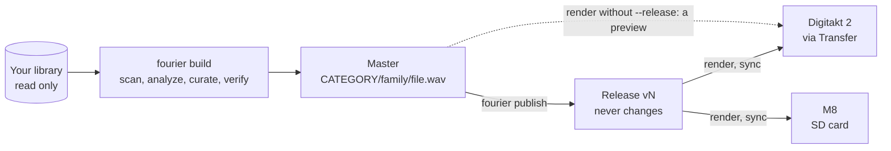

# Fourier Samples

Turn a big, messy sample library into small, well-organized folders for your hardware sampler.

[](https://github.com/bvk7787/fourier-samples/actions/workflows/ci.yml)

[](https://github.com/bvk7787/fourier-samples/blob/main/LICENSE)

[](https://scorecard.dev/viewer/?uri=github.com/bvk7787/fourier-samples)

Years of sample packs add up to more files than anyone can browse, and a sampler's screen shows
about ten names at a time. Fourier Samples (the `fourier` command) picks the best of them and
sorts them into `CATEGORY/family/file.wav` folders named for what they sound like. It fixes what
would bite on the device: DC offset, phase-flipped stereo, clicks at the end, notes a few cents
off. Then it renders the result for each sampler, such as the Elektron Digitakt 2 and the
Dirtywave M8. Your library is only read, never changed. Once a release is on a device its paths
stay put, so the projects you make with it keep working.

**New to Terminal?** [Getting started on a Mac](https://github.com/bvk7787/fourier-samples/blob/main/docs/start.md) takes you from nothing to
sounds on your sampler, one step at a time, with what you should see after each.


## What a build makes

A build reads your **library** (your sample packs) and writes the **master**, the curated set.
A **render** is the master converted for one device. A **release** is a saved copy of the master
that never changes, and it's what you load onto a device.

```
your library                                 the master                 device renders
Acme Drums Vol 3/                            KICKS/                     01_KICKS/
  Kits/Kit 07/BD_Demo_07.wav        --->       tight-punchy/              tight-punchy/
  One Shots/Kick_Soft_A#1.wav                    BD_Demo_07.wav             BD_Demo_07.wav
Northwind Loops/                             DRUMLOOPS/                 08_DRUMLOOPS/
  174/Break 174 dusty.aif                      170-175bpm-dusty/          170-175bpm-dusty/
  ...                                            Break_174_dusty.wav        Break_174_dusty.wav
                                             KITS/  SLICE/              00_KITS/  00_SLICE/
                                             manifest.json  loops.csv
```

- **Nineteen categories** in play order (kicks, snares, claps, hats, cymbals, toms, percussion,
  drum loops, phrases, sub, synth, stabs, pads, piano, acoustic, waves, FX, blips, voices), plus
  any your own overlay adds.
- **Families** of similar sounds, named for what they share. CLAP, an AI model that runs on
  your computer, listens to each sample. Drum loops go into 5-BPM tempo folders.
- **Drum kits and slice-ready loops** built from the picks (`KITS`, `SLICE`).
- **A manifest** recording where every file came from and why it's there (`fourier why <name>`).
- **Device renders** at each sampler's format and path rules, and **releases** that never change.
- **A master the size of your library.** A large library gets the style's full master, about
  8,000 to 11,500 sounds depending on the style. A smaller library gets a master in proportion,
  so a few packs still fill every category they have sounds for.

**For** anyone with a large library of sample packs and a hardware sampler (a Digitakt 2, an
M8, or anything that loads WAV folders) who wants several thousand good, consistently named
sounds on it, and can paste a few commands into Terminal. **Not for** browsing or tagging a
library (a sample browser does that), editing samples, or finding new ones. It ships no audio.

## Try it in a minute

```bash
curl -LsSf https://astral.sh/uv/install.sh | sh     # installs uv (it brings its own Python)
```

Then quit Terminal and open it again so it finds uv, and run:

```bash
uv tool install fourier-samples
fourier demo
```

Already have Python 3.11 or later? `pipx install fourier-samples` works too, or `pip install
fourier-samples` in a virtual environment. For the latest code, run `uv tool install
"fourier-samples @ git+https://github.com/bvk7787/fourier-samples"`.

`fourier demo` needs no library and no model. It generates 280 synthetic samples in
`./fourier-demo` (or `--dir PATH`), builds and verifies a master from them, and renders it for
the Digitakt 2 and the M8. It takes a minute or two. Everything stays in that folder, and it ends
by saying what to try next.

## Requirements

- **macOS or Linux**, with Python 3.11 or later (uv brings one). Tested on Apple Silicon; Intel
  Macs are untested. Windows doesn't work yet ([#9](https://github.com/bvk7787/fourier-samples/issues/9)).
- **For a real build, the CLAP model.** `fourier setup` installs PyTorch and Transformers and
  downloads the model once, about 800 MB in all. PyTorch is about 200 MB of that (about 750 MB
  installed) and the model about 600 MB. On Linux with an NVIDIA GPU, PyTorch's CUDA build is
  several GB. The demo needs none of this.
- **Disk.** About 25 GB free for a large library. The master is 5 to 7 GB, or less for a smaller
  library or with `size`. Each device render and release takes up to as much again, plus the
  downloads and the caches in `~/.fourier`.
- **Time.** The first build listens to every sample, about an hour for each 100,000 files;
  later builds take minutes.
- **Any library size, any layout.** Maker/pack folders, folders by sound type, or one flat
  folder all work.
- **Optional: [Sononym](https://www.sononym.net) and Ableton Live.** When their data is there,
  a build reads Sononym's classification and Live's auto-tags. Without them, built-in
  classifiers read file names, folders and the audio itself. On a large enough library, a sound
  model trained on it places what names don't. You can rate files without Live too (`fourier
  review rate`).
- **Optional: [Ollama](https://ollama.com)**, for folder descriptions from a local LLM.
  `fourier setup` offers it when it's there.

## Quick start on your own library

```bash
fourier setup                           # your samples, devices and style; installs the CLAP model
fourier build                           # scan, analyze what's new, build and verify (resumable)
fourier open report                     # a page in your web browser: listen, see why, rate
fourier publish --notes "first set"     # save it as releases/v1, which never changes
fourier render digitakt_2 --release v1  # v1 for the Digitakt 2, its paths locked on the device
fourier open renders digitakt_2         # the folders to drag into Elektron Transfer
fourier render m8_tracker --release v1 && fourier sync m8_tracker /Volumes/M8   # or onto the M8's card
```

`fourier setup` asks a few questions, one step at a time. Each says what it's for and can be
skipped. Drag your sample folder in from Finder, and pick devices and a style by number. Setup
writes `~/.config/fourier/fourier.toml` (`fourier config edit` opens it), installs the CLAP
model and checks everything. `fourier setup --yes --library ~/Samples --device digitakt_2`
answers the questions up front. Run it again and it keeps the config it wrote; `fourier setup
--yes --force --library ... --device ...` replaces that config.

The first `fourier build` analyzes the whole library, which is the long part. It gives an
estimate before it starts. `fourier build --dry-run` shows files, disk space and time per
category without writing anything. A build that stops picks up with `--resume`. Later builds
only scan and analyze what's new.

`fourier doctor` (also setup's last step) marks each line and says what to do about it:

- **OK**: fine.
- **WARN**: worth a look.
- **NEXT**: the first build does this itself (scan, analyze, index and, if setup didn't,
  download the model).
- **FAIL**: this would stop a build, such as no CLAP install, no library, or a folder it can't
  read.

**Digitakt 2:** connect it over USB, open Elektron Transfer and drag the render's category
folders into a folder on the +Drive, such as `/fourier`. Transfer never overwrites a file of
the same name (its manual, pp. 10-11), so files already on the device stay as they are.

**M8:** `fourier sync` copies the render to `/Samples/Fourier` on the card, without the `._`
files macOS leaves behind.

A render of a release locks its paths on the device, and later releases keep them, so your
projects keep working. `fourier render digitakt_2` without `--release` renders the master
itself. That's a preview to try, and its paths can change with the next build. `fourier publish
--dry-run` says what a new release would change, and `fourier render <device> --dry-run` says
what a render would change on the device.



[The guide](https://github.com/bvk7787/fourier-samples/blob/main/docs/guide.md) covers what
comes after the first build: adding packs to a release, rating, making it yours, and what to do
when something goes wrong. [docs/usage.md](https://github.com/bvk7787/fourier-samples/blob/main/docs/usage.md)
has every command, the words used here, rating files, configuration, and the styles and knobs.

Working with a coding assistant? [skills/fourier/SKILL.md](https://github.com/bvk7787/fourier-samples/blob/main/skills/fourier/SKILL.md)
teaches it Fourier: the safe commands, how to read a build, and the usual fixes. Copy the
`fourier` folder into `~/.claude/skills/` for Claude Code, or point your assistant at the file.

## Updating

```bash
uv tool upgrade fourier-samples       # keeps your setup: PyTorch, Transformers and their build
fourier doctor                        # then check
```

An upgrade keeps your settings, your Fourier home, the master and your releases. With pipx, run
`pipx upgrade fourier-samples`. [usage.md, "Installing and updating"](https://github.com/bvk7787/fourier-samples/blob/main/docs/usage.md#installing-and-updating)
explains how the CLAP software is kept across upgrades, and how to update PyTorch.

## Devices

| Profile | Device | Renders |
|---------|--------|---------|
| `digitakt_2` | Elektron Digitakt 2 | `NN_CATEGORY/family`, 48 kHz / 16-bit, stereo kept |
| `m8_tracker` | Dirtywave M8 | `/Samples/Fourier/NN_CATEGORY/family`, 44.1 kHz / 16-bit, whole path under 128 characters |
| `generic_44k`, `generic_48k` | anything else | `NN_CATEGORY/family`, 16-bit stereo WAV; no limits claimed |
| `generic_folder` | a folder for a DAW or a computer | `NN_CATEGORY/family`, 44.1 kHz / 24-bit WAV, no folder or name limits |
| `generic_sd_card` | a sampler that reads WAV from an SD card | `/Fourier/NN_CATEGORY/family`, 44.1 kHz / 16-bit, 128 files a folder, plain-ASCII names; no limits claimed |

Every value in a profile cites a page of the device's manual or says it's a convention or
unverified. A test checks each quote against its page when the PDF is at hand.

Your device isn't listed? `fourier devices new` writes a profile for it in a few questions. See
[your own device](https://github.com/bvk7787/fourier-samples/blob/main/docs/usage.md#your-own-device).

## Safety and trust

**Your library is read-only.** Fourier Samples reads your sample folders and, when they're
there, the Sononym and Live databases. It opens those read-only. They aren't official APIs, so
an app update can break the reading. The only command that writes into a library folder is
`fourier tools import-folder`, which adds copies there. Here is everything else it writes:

| What | Where, by default | Moved by |
|------|-------------------|----------|
| Config | `~/.config/fourier/fourier.toml` | `fourier setup --to` |
| Home: database, CLAP index, caches, ratings, build history | `~/.fourier` | `$FOURIER_HOME` |
| Master, plus `<master>.next` during a build and `<master>.prev` after one | `~/Music/FourierCurated` | `[output] master` |
| Renders (each marked with a `.fourier-render` file) | `~/Music/FourierRenders` | `[output] renders` |
| Releases and device path locks | `~/Music/Fourier/releases`, `~/Music/Fourier/devices` | `[output] publish` |
| The CLAP model | `~/.cache/huggingface` | `$HF_HOME` |
| A card's folder, with a `.fourier-card` marker | `/Samples/Fourier` on the M8's card | the device profile |
| Live rating sidecars | inside the master only | |

- **It refuses to overwrite what it didn't make.** A build stops if the master holds a file it
  didn't make, and lists it. It never builds into a library, a release or a non-empty folder of
  yours. A render only replaces a folder marked as a render, and the demo only a demo folder.
  `fourier sync --delete` removes only files this tool put on that card, and anything else
  there stops it.
- **Nothing is replaced until it passes.** A whole build goes into `<master>.next`. It replaces
  the master only when every category built and `fourier verify` (more than 100 checks)
  passed. If it stops part way, the master is unchanged, and `fourier build --resume` picks up
  where it left off. A one-category build, such as `fourier build KICKS`, writes into the
  master directly, so run `fourier verify` after it.
- **Undo.** The previous master stays in `<master>.prev` until the next build. Move it back to
  undo one. A release never changes: `fourier publish` never overwrites one without `--force`,
  and never one a device uses. To roll a device back, render an earlier release.
- **Network.** When you say yes, `fourier setup` installs PyTorch and Transformers from PyPI, or
  from PyTorch's own index for the CPU-only build. It downloads the CLAP model once from
  Hugging Face, pinned to one revision. If you skip that, the first build that needs the model
  downloads it. After that the model loads from its folder with Hugging Face offline, so
  analysis, builds and search make no request to Hugging Face. A local LLM (Ollama, on
  `localhost`, never through a proxy) is used only if you turn folder descriptions on or run
  `fourier tools audit`. Nothing else, and no telemetry.
- **Audio and licenses.** It reads open formats, doesn't circumvent copy protection and
  distributes no audio. Your master, renders and releases are copies of your samples, under
  their licenses. They're for your own use, so don't share or upload them. The `manifest.json`,
  build logs and `fourier doctor` output name your folders and packs, so check them before
  posting. The CLAP model was trained on public audio datasets, and
  [THIRD_PARTY_NOTICES.md](https://github.com/bvk7787/fourier-samples/blob/main/THIRD_PARTY_NOTICES.md)
  summarizes their terms.
- **How it's tested.** The test suite runs in CI on Linux and macOS with Python 3.11 to 3.14.
  Coverage is measured and mypy checks the source. The suite includes a first run end to end
  without Sononym or Live, and a synthetic library built and compared against a stored result.
  Both check that the library is unchanged afterward
  ([CONTRIBUTING.md](https://github.com/bvk7787/fourier-samples/blob/main/CONTRIBUTING.md)).
  Tested on hardware: macOS on Apple Silicon with a Digitakt 2 (OS 1.16) and an M8.
- **Provided as is**, under Apache-2.0, without warranty. Keep backups of anything you can't
  replace.

## Uninstall

Run `uv tool uninstall fourier-samples` (or `pipx uninstall fourier-samples`, or `pip
uninstall fourier-samples`). Then delete the folders in the table above that you no longer want
([step by step in Finder](https://github.com/bvk7787/fourier-samples/blob/main/docs/start.md#9-uninstall)). The master, renders and releases
are yours to keep: they're plain WAV folders.

## Compared with

- **Sononym** (paid) is a sample browser with similarity search and auto-categorization. It
  helps you find a sound; Fourier Samples builds and maintains the folders on a device, and can
  read Sononym's analysis.
- **SampleStack** (macOS) validates, converts and exports samples for many samplers
  (https://samplestack.app). Fourier Samples picks a set from a whole library and keeps device
  paths stable across releases.
- **DigiChain** (web) builds sample chains from files you've already chosen
  (https://digichain.brianbar.net).

## Contributing and license

Issues and pull requests are welcome: see
[CONTRIBUTING.md](https://github.com/bvk7787/fourier-samples/blob/main/CONTRIBUTING.md), the
[code of conduct](https://github.com/bvk7787/fourier-samples/blob/main/CODE_OF_CONDUCT.md),
the [security policy](https://github.com/bvk7787/fourier-samples/blob/main/SECURITY.md) and the
[changelog](https://github.com/bvk7787/fourier-samples/blob/main/CHANGELOG.md).

Copyright 2026 the Fourier Samples authors. Apache-2.0
([LICENSE](https://github.com/bvk7787/fourier-samples/blob/main/LICENSE),
[NOTICE](https://github.com/bvk7787/fourier-samples/blob/main/NOTICE)); third-party terms,
including the CLAP model's training data, in
[THIRD_PARTY_NOTICES.md](https://github.com/bvk7787/fourier-samples/blob/main/THIRD_PARTY_NOTICES.md).

Elektron, Digitakt, Dirtywave, M8, Ableton, Live, Sononym, SampleStack, DigiChain and the other
product and company names here, including instrument names used to label folders, are
trademarks of their owners. Fourier Samples is an independent project, not affiliated with or
endorsed by any of them.
