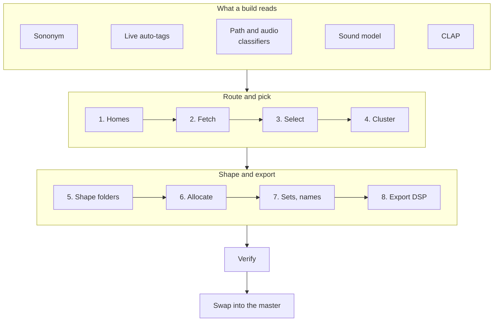

# Fourier Samples curation reference

The maintainer reference for curation: how `fourier build` turns the analyzed library into the
curated master, how the master is rendered for the M8 and Digitakt 2, and how builds, ratings
and releases stay safe. Users start with the [README](../README.md).

Constants live in `src/fourier/packs/curate_config.py`, the pipeline in `curate.py` and its
neighbors in `src/fourier/packs/`. Where this page and the code disagree, the code wins.

Budgets, tempo bands and drum-loop rules quoted here are preset `breaks-acid`'s, the reference
style the goldens build (section 3.4). The code's own defaults are `balanced`'s, which differs
only in its budgets (drum loops 1,140, more pads, keys and voices), its 70-180 BPM bands, the
drum loops' style exclusions and the surplus round.

## Contents

1. [The master](#1-the-master)
2. [Classifiers and tags](#2-classifiers-and-tags)
3. [Build pipeline](#3-build-pipeline)
4. [Category rules](#4-category-rules)
5. [Naming](#5-naming)
6. [Export DSP chain](#6-export-dsp-chain)
7. [Ratings](#7-ratings)
8. [Device renders](#8-device-renders)
9. [Derived sets](#9-derived-sets)
10. [Build safety and history](#10-build-safety-and-history)
11. [Additive builds](#11-additive-builds)
12. [Verify](#12-verify)
13. [Known limitations](#13-known-limitations)
14. [Decision log](#14-decision-log)

Without Sononym the built-in providers classify, and these rules differ:

- [2.1](#21-classifier-and-tags): the `path` and `audio` providers, the folder walk, missing
  files, path words standing in for Live's tags.
- [2.2](#22-routing-without-sononym): drum-loop evidence, sound-model and CLAP homes, and
  other routing by path and audio.
- [2.3](#23-the-sound-model): when the sound model trains and what it places.
- [2.4](#24-sources-and-resolution): where tempo, one-shot or loop, and the root come from.
- [3.1](#31-homes-and-routing-precedence): rules 11, 12 and 21.
- [3.2](#32-selection-gates): drum evidence (step 11) and the near-duplicate tempo rule.
- [Drum-loop tempo](#drum-loop-tempo) and [PHRASES](#phrases): stated tempos, the fallback
  chain, drum loops kept out of PHRASES.
- [5.1](#51-folders) and [5.2](#52-files): the `musical` trait and bare note letters in names.
- [13](#13-known-limitations): the harmonicity measure.

## 1. The master

The master is a local folder: `[output] master` in `fourier.toml`, or `$FOURIER_CURATED_DIR`,
which wins (default `~/Music/FourierCurated`). Keep it out of cloud-synced folders: a build
rewrites many files at once, and a sync client can leave conflict copies beside them.

| Path | What |
|---|---|
| `<CATEGORY>/<family>/<file>.wav` | curated files, one folder level per family |
| `<CATEGORY>/_manifest.json` | per folder: source, clap phrase, `clap_z`, `clap_support`, band, traits, bpm, `bpm_range`, base note, pool size `n`, `copied` |
| `KITS/<kit>/`, `SLICE/<family>/` | derived sets (section 9) |
| `manifest.json` | build manifest (section 1.2) |
| `loops.csv` | every drum loop: folder, file, bpm, bars, folder_bpm, bars_at_folder_bpm, swing_pct, slice_clean, slice_ready, swung |
| `CHANGELOG.md` | changes against the previous archived build |
| `_REVIEW/` | review queue (hard links; never published or rendered) |

### 1.1 Categories, in play order

Renders number category folders in this order (`CATEGORY_ORDER`, `category_dir`); the master
keeps plain names. Derived sets render as `00_KITS`, `00_SLICE` (`DERIVED_DIRS`).

| # | Category | Kind | Holds |
|---|---|---|---|
| 01 | KICKS | oneshot | kicks |
| 02 | SNARES | oneshot | snares, rims, rimshots |
| 03 | CLAPS | oneshot | claps, snaps |
| 04 | HATS | oneshot | hats, shakers, tambourines; bands closed / open |
| 05 | CYMBALS | oneshot | bands ride / crash / cymbal |
| 06 | TOMS | oneshot | toms |
| 07 | PERC | oneshot | hand and metal percussion, cowbell, agogo |
| 08 | DRUMLOOPS | loop | breaks and drum loops; bands classic / full / tops |
| 09 | PHRASES | loop | musical loops: basslines, chords, leads, live instruments |
| 10 | SUB | oneshot | bass one-shots |
| 11 | SYNTH | oneshot | leads, synth keys, synth bells and mallets |
| 12 | STABS | oneshot | named stabs and chord stabs only |
| 13 | PADS | oneshot | pads, textures |
| 14 | PIANO | instrument | piano, e-piano, clav, organ; bands note / chord |
| 15 | ACOUSTIC | instrument | acoustic instruments; bands string / wind / plucked / mallet |
| 16 | WAVES | waves | single cycles and wavetable frames; bands cycle / table |
| 17 | FX | oneshot | transitions, impacts, noise, foley, scratches; 10 bands |
| 18 | BLIPS | oneshot | blips, zaps, bleeps |
| 19 | VOX | oneshot | vocal shots (choirs capped) |

A library overlay can add its own categories ([Adding a category](#adding-a-category)). They
are numbered after these, from 20, in the order it adds them, so adding or removing one never
renumbers another's device folder.

Retired names are categories earlier versions merged into others (BELLS, ORCHESTRAL, MALLETS
-> ACOUSTIC; SCRATCHES -> FX, as its scratch band). `RENAMED_CATEGORIES` maps them, so a rating
such as `Move-MALLETS` still lands in the right category, and verify fails on a folder with an
old name.

### 1.2 manifest.json

- Top level: `fourier_manifest` (2: each entry's canonical `labels`), `seed` (`CURATION_SEED`
  0), `git_sha`, `config_hash` (CATEGORIES), `code_hash` (curate_config, curate, naming),
  `ratings_hash`, `clap_model` (`laion/clap-htsat-unfused`), `generated`. Additive builds add
  `base` and `add_allowance`; a library-scaled build adds `scale` (`factor`, `samples`,
  `per_master`, `keep_all`, `min_files`, `folder_files`, `folder_min_files`; section 3.5).
- `categories.<CAT>`: `families`, `files`, `source_samples`, `note_gated`, `loop_gated`,
  `chain_gated`, `entries`, plus `built` from the parallel path, and `budget` where a surplus
  round raised it or the library scaled it.
- Entry, always: `family`, `out`, `src`, `out_md5`, `support`, `band`, `sononym`, `ableton`,
  `son_cats`, `ab_cats`. Loops: `bpm`, `bpm_src` (`name` / `sononym` / `librosa`), `bpm_fold`;
  DRUMLOOPS also `bars`, `slice_clean`, `swing`, `rotate_ms`. When set: `loop_row`, `retune`,
  `root_src`, `level_db`, `dsp_fallback`, `from_base`, `added_over`.
- `sets.KITS` / `sets.SLICE`: entries with `came_from` (the curated file) and, on a kit file
  turned down, `gain_db`. Category rules don't apply to sets.

## 2. Classifiers and tags

A build reads each sample's labels through providers (`src/fourier/metadata/providers.py`).
Sononym and Ableton Live are both optional; where this page says Sononym's class or label, read
the classifier in use.

CLAP embeds a file's first 10 seconds (`clap_features.CLAP_WINDOW_S`): its feature extractor
would crop a longer clip at a random offset, so Fourier hands it the start and a long loop or
phrase embeds the same on every run.

### 2.1 Classifier and tags

- **Classifier.** Sononym (class, category and measurements) when the library has its data,
  which a build's scan (`fourier tools scan`) reads. Otherwise two built-in providers stand
  in, and every library file is a candidate:
  - `path`: labels from generic words in folder and file names (`config/providers/path.yaml`).
    One-shot or loop comes only from the file's name and folder, never a vendor's or pack's
    name; a format folder such as `WAV` hands over to the one above, and a drum hit's name
    beats its folder's loop word (`shadow.shape_labels`).
  - `audio`: one-shot or loop from Fourier's own measurements: events between silences, and
    onsets for a groove with no silent gap.
- **Folder walk.** Without Sononym, or with `fourier tools scan --walk`, the scan walks the
  library (`src/fourier/ingest/walk.py`): the `ingest/formats.py` formats soundfile reads,
  folder symlinks out of the library followed (each real folder once), dot files and Fourier's
  own folders skipped.
- **Missing files.** A sample the last walk didn't find (moved, renamed, deleted, unreadable)
  is marked missing (`missing_files`) and is no candidate (`metadata/rows.py`,
  `sample_select`); the library scale counts only the rest (`rows.usable_count`). A database no
  walk marked reads as before.
- **Tags.** Live's auto-tags (`is_auto = 1` keywords in `Live-files-<ver>.db`), stored by the
  scan on `Sample.ableton_tags` when Live's file index is there, matched by path. Each votes its
  mapped category (`ABLETON_TAG_CATEGORY`, end of 2.4) as the classifier's equal.
- **Without Live**, tag votes and rules that read a tag don't fire. The few tags a category
  needs as evidence come from whole words of the file's name and folder (`NAME_TAGS`,
  `curate._name_tags`): "drum loop", "break", "breakbeat", "beat" or "groove" for a drum loop's
  "Drum Loop"; violin, viola, cello, double bass or string ensemble for ACOUSTIC's bowed
  strings. A file whose own name names a drum hit takes none from its folder. A loop by its own
  name or folder ("Loops/Roller 01") may take a loop tag from its pack's name ("Jungle Breaks"),
  which never makes a file a loop; a loop by its audio alone takes nothing from it.
- **Path words** (without Sononym) are split into letters, digits and camelCase
  (`shadow.words_of`: "kick01", "HiHat58", "BD01", "808Kick"; a plural "s" after a number stays,
  "808s"). `path.yaml` knows common abbreviations (BD, kck, SD, snr, CH / OH / CP in the file's
  own name or folder, cym, perc, FX / SFX, fills, chords, 808s, subs, strings, brass); the
  `words` knob adds a library's own (`words = { KICKS = ["bombo"] }`: `PATH_WORDS`, a strong
  word for the category's first label).
- **Choosing providers.** `fourier.toml` can name them (`providers = ["path", "audio"]`, ...);
  the manifest records those used. CI builds the synthetic library without Sononym, without
  Live and without both, and each fills every category.

### 2.2 Routing without Sononym

None of this applies with Sononym.

- **Sustained sounds aren't drum loops.** A file whose own name or folder names an instrument
  or FX sound (bass, lead, keys, pad, stab, bell, blip, zap, scratch, vocal, any FX label) and
  no loop is a one-shot of that sound, whatever its onsets (`shadow.audio_label`): a riser, pad
  or bassline has onsets and no silent gap, as a groove has.
- **Drum loops need drums.** A loop's DRUMLOOPS vote stands only with drum evidence
  (`curate._drum_loop_evidence`): a drum tag; a drum, break, beat or groove word in its own name
  or folder; for a loop by its own name or folder, a drum, percussion, break or beat word in its
  vendor or pack folders ("Drum Hits/Loops/House 120 01"; `_pack_drum_named`, never what makes
  a file a loop); or percussive audio (harmonicity at most DRUMLOOPS' `har_max`, onsets at the
  loop rate). The phrase rule leaves such a loop to the drum loops (`_providers_drum_loop`),
  where percussive audio doesn't count if its own name or folder names an instrument ("Bass
  Loops/Bassline 120bpm"). DRUMLOOPS' drum-tag requirement accepts the same evidence.
- **Sound model** (once trained on the library, 2.3). A sample no name rule recognized goes to
  the model's category, ahead of the CLAP fallback, at probability `SOUND_MODEL_MIN` (0.70) or
  more. A sample whose own name and folder hold no strong category word (its pack's or vendor's
  name, or a weak word such as "FX" or "Perc", gave it one) goes there at
  `SOUND_MODEL_OVERRIDE_MIN` (0.90) or more when the model disagrees with the words or picks
  among several candidates. Only one-shot categories and the drum loops qualify (instruments,
  waves and phrases go by name; STABS holds named stabs only), and the category must fit the
  sample's shape (from its names or audio, else the model's). The why log records
  `sound_homed` with the probability, `fourier why` says "sound model: PADS 0.86", and a
  sound-homed loop counts as a drum loop for DRUMLOOPS' drum requirement (its CLAP gate still
  applies).
- **CLAP fallback.** A sample with a shape that no name rule recognized (no category from path
  words, Live's tags or their stand-ins, no rule placing it by name) is homed by sound
  (`curate._clap_home`): a one-shot at the nearest one-shot category's CLAP anchor (not
  STABS), a loop at the drum loops' gate. It must clear that category's gate (`break_min`, else
  `CLAP_FALLBACK_MIN` 0.30) by `CLAP_FALLBACK_MARGIN` (0.02) and beat its anti-prompts and the
  runner-up by as much. A near tie (within `CLAP_FALLBACK_PREFER_MARGIN`, 0.05) with the
  category `CLAP_FALLBACK_PREFER` prefers goes to that one if it clears its own gate (HATS ->
  CLAPS: CLAP hears a clap's noise burst much like a hat's). The why log records `clap_homed`,
  `fourier why` says "placed by sound (CLAP), no name rule matched", and a CLAP-homed loop
  counts as a drum loop for DRUMLOOPS' drum requirement.
- **Unrecognized**: the rest. A build that leaves categories empty says how many, in which
  folders, and what to do (`words`, renaming, `sources.home`); `fourier why --unrecognized`
  lists them and `build --dry-run` counts them.

More routing by path and audio:

- **Keys**: `path.yaml`'s `keys` label (piano, e-piano, rhodes, wurli, organ, clav,
  harpsichord; "EP" in a file's own name or folder; "keys" and "keyboard" as weak words) homes
  nowhere (`curate._keys_labeled`: keys and no other sound); PIANO's pool takes it by name, and
  there one event between silences is one note or chord, whatever its onsets.
- **Sustained sounds**: the audio provider calls a sound a one-shot, however long, when it's
  mostly harmonic (`SUSTAINED_HPR`, 0.8) with onsets slower than `SUSTAINED_MAX_HZ` (2 a
  second): a pad changing chords, which its onsets alone made a loop.
- **Drum loop marked as a phrase**: a loop the phrase rule homes in PHRASES whose CLAP scores
  fail PHRASES' gate (closer to the drum breaks) and pass a drum-loop category's by
  `CLAP_REHOME_MARGIN` (0.10) over its minimum and its anti-prompts is homed there
  (`curate._clap_rehome`; manifest `rehomed`, why log `clap_rehomed`; `fourier why`: "fell back
  to DRUMLOOPS by sound"). There the CLAP gate is its drum evidence, its harmonicity isn't held
  against it, and verify's phrase rule passes it.
- **Phrase homed as a drum loop**: the reverse. A loop in a drum-loop category (by a drum word
  in its path, or its audio) that fails its gates (CLAP, or too tonal for `har_max`), passes
  PHRASES' CLAP gate by the margin, and fits PHRASES (marked as a phrase, `PHRASE_DUR` long,
  whole bars) is PHRASES' ("fell back to PHRASES by sound").
- **Loop folder that says nothing**: a loop named only by a number, a tempo and a loop word, in
  a folder named only by a tempo or loop word (`Loops/85/loop_17.wav`), naming no sound
  anywhere in its path (`curate._anonymous_loop`), is a drum loop by its audio when its onsets
  are busy (`ANON_LOOP_ONSET_MIN_HZ`, 2 a second) and harmonicity at most `ANON_LOOP_HAR_MAX`
  (0.80): lo-fi drums read more tonal than DRUMLOOPS' gate, and nothing else speaks for them.
  The phrase rule leaves it to the drum loops; a musical one taken by mistake falls back to
  PHRASES by sound.
- **No shape**: a sample no name, folder or audio rule calls a one-shot or loop, that is one
  event between silences or a held, mostly harmonic sound with slow onsets (`curate._held`),
  is offered the one-shot categories by the CLAP fallback.
- **Held, tonal "loop" with no stated tempo**: offered the one-shot categories too
  (`curate._held_loop`), so a pad changing chords in an unsorted folder reaches PADS. It's a
  loop by onsets alone, with no silence in it, onsets slower than `SUSTAINED_MAX_HZ` (chord
  changes, not a beat), tonal by Fourier's own analysis (`resolve.own_tonal`: harmonic share
  0.6 or more, pitch focus 1.5 or more), and no whole-bar tempo stated by its name, folder or
  ACID chunk (an estimate from audio or length doesn't count: slow onsets carry no beat). One
  with silences between chords reads as several sounds, and PADS' sample-chain guard leaves it
  out.
- **Recognized, placed nowhere**: `fourier why --unrecognized` also lists samples a name rule
  recognized but the last build placed nowhere ("recognized as lead, but no category took it",
  `curate.placed_nowhere`): no category's why log names them, because a rule kept them out of
  the categories their labels vote for, or that category is off.
- **Shaker or tambourine in a percussion folder** (`Perc/`, `Percussion/`): PERC's unless its
  name says hi-hat (`rules._drum_named_in`, for the homes, the drum-name gate, verify and why).

### 2.3 The sound model

A small classifier trained on your library (`src/fourier/metadata/sound.py`, provider
`fourier:sound`; `src/fourier/metadata/train.py`): multinomial logistic regression over the
CLAP embedding (L2-normalized) and some of Fourier's own measurements (length, onset rate,
harmonic share, events, spectral centroid and flatness, pitch focus, attack and decay:
`sound.OWN_FEATURES`). For every sample with a CLAP embedding it gives a category (the 19
built-in ones, or "other") and one-shot or loop, each with a probability: labels of kind
`category` and `class`, the probability as their confidence and as descriptors `p_category`
and `p_loop`.

- **Learns from** the pack makers' folder and file names, read by the path provider's rules
  (`sound.training_label`: a category word in the file's own name or folder, never a pack's or
  vendor's name alone; waves, acoustic instruments and organs by their name rules; a loop is a
  drum loop or phrase by the sound it names), and your ratings (`sound.rating_label`: Keep in a
  category, Misfiled with a category to move it to; a Misfiled without one removes that
  category's name label). Optionally the taxonomy's CLAP prompts are a prior pulling the
  weights (`--clap-prior`).
- **Never uses**, as label or feature, Sononym's analysis (labels, scores and signatures,
  `sononym_meta`, and the `sample_features` columns computed from it: `loop_confidence`,
  `is_pitched`, `bpm_reliable`, `transient_score`, `timbral_norm`, ...) or Live's tags
  (`sound.FORBIDDEN`). `tests/test_sound_model.py` checks the code, and that a database with or
  without them trains the same weights to the bit.
- **Training** (`metadata/train.py`, read-only against the library's database) splits the
  labeled samples by pack (vendor/pack folders; no pack on both sides, about a fifth held out).
  Class-balanced weights, L2, L-BFGS stopped at its best holdout loss, then a temperature fitted
  on the holdout (calibration), for category and for shape: about a minute even for a large
  library. Weights go to `<home>/sound_model.npz` (weights, biases, the features' means and
  standard deviations over the library, temperatures, categories, how many samples it learned
  from, the model's version, and the CLAP model and revision; no file names or per-sample data).
  Beside them goes a report: label counts, holdout agreement per category, the confusion
  matrix, coverage at confidence thresholds and, with Sononym, agreement with Sononym's category
  and class as a yardstick, measured after the weights are written and never fed back.
- **When it trains**: without Sononym, the analysis's sound step (so the first build) trains it
  when the home has none and the library's own names label at least `SOUND_TRAIN_MIN_LABELS`
  (1,000) samples across `SOUND_TRAIN_MIN_PACKS` (8) packs, and again when labeled samples grow
  by `SOUND_RETRAIN_GROWTH` (25%, and at least 500). Below that it says what's missing and the
  CLAP fallback places what no name rule recognizes. A model is kept only if reliable on packs
  it didn't learn from: at least `SOUND_KEEP_MIN_ACCURACY` (80%) of its calls at
  `SOUND_MODEL_MIN` or more agree with the names, those calls cover at least
  `SOUND_KEEP_MIN_COVERAGE` (10%) of held-out samples, and at least `SOUND_KEEP_MIN_HELD` (200)
  were held out. Otherwise it's discarded (the report's verdict says why) and retried once the
  library has grown as much as a retrain needs; a library of a few packs usually stays with the
  CLAP fallback. `fourier tools train` trains it now, with or without Sononym. Off with
  `SOUND_TRAIN = false` in `[advanced]` (`fourier setup --no-sound-model`) or
  `$FOURIER_SOUND_MODEL`. A model in the home with no count of what it learned from (made by
  hand) is never replaced.
- **No shipped weights**: they're learned from a sample library, and sample licenses differ
  (some forbid using the sounds in software, or for training models). Weights trained on your
  library stay on your machine, under your licenses; don't share them.
- **Labeling** (`fourier tools analyze --only sound`, part of every analysis, so a build runs it
  on what's new): a matrix multiply over the embeddings of samples not yet labeled, and of every
  sample when the weights change (the `analysed` descriptor carries the model's version). A
  sample embedded by another CLAP model or revision than the weights' isn't labeled. Without
  weights the provider is off and its old labels are removed; `$FOURIER_SOUND_MODEL` names
  another weights file, or `off`.
- **Quality** depends on the library; the report says, and a build or `fourier tools train`
  prints the summary. On a large library of commercial packs, against the makers' names on packs
  it never learned from, the category agreed 72.6% of the time (64% averaged over categories):
  84% at probability 0.50 or more, 92% at 0.70 (`SOUND_MODEL_MIN`), 97% at 0.90
  (`SOUND_MODEL_OVERRIDE_MIN`). Drums were strong (kicks, snares, claps, hats, cymbals, toms,
  percussion, drum loops: 76 to 90% recall), tonal sounds weak (synths, pads, basses, stabs,
  keys: 17 to 53%), so it places a sample only at `SOUND_MODEL_MIN` or more, never in the
  instrument, waves, stabs or phrases categories. One-shot or loop agreed 98.8% of the time.
- **With Sononym** it routes nothing. `fourier why` shows its call ("sound model: PADS 0.86,
  one-shot 0.97 (a report: Sononym routes)"); `fourier tools db-stats --disagreements` lists
  where its category and Sononym's differ, most confident first. A build with Sononym is the
  same with or without it (`synthetic_build.py --check --sound`).

### 2.4 Sources and resolution

Every stored value has one source, whichever providers a library has
(`src/fourier/db/models.py`; database schema 2):

| Source | Where | What |
|--------|-------|------|
| `sononym` | `sononym_meta`, the `sononym` labels and descriptors; `sample_features.sononym_bpm_folded` and the legacy columns the derived step computes from Sononym's (`bpm_reliable`, `is_pitched`, `sub_weight`, `loop_confidence`, ...: NULL without a Sononym row) | Sononym's class, categories, tempo, base note, timbre |
| `fourier:audio` | `sample_features`: `tempo_bpm` (librosa, folded into 60-200), `onset_rate_hz`, `harmonic_percussive_ratio`, `chroma_concentration`, the events, `own_root_midi` (pYIN), `detected_key`; the `audio` provider's labels | Fourier's own analysis of the audio |
| `fourier:name` | the `path` provider's labels and its `bpm` (a tempo written in the path) | Fourier's reading of the file's name and folders |
| `fourier:sound` | the `fourier:sound` labels and descriptors | the sound model's category and shape, from the CLAP embedding and Fourier's own measurements |
| `acid`, `chunk` | `samples.acid_bpm`, `acid_beats`, `root_note` | what a WAV's own ACID / smpl chunks state |

`bpm_corrected` is legacy: before schema 2 it held Sononym's folded tempo, or librosa's where
Sononym had none. Nothing writes or reads it now.

The build takes values from the resolver (`src/fourier/metadata/resolve.py`), which names each
one's source. With Sononym it chooses exactly what curation chose before it existed:

- **Loop tempo**: one the filename states, else the classifier's, else Fourier's own, each at
  x1, x2 and x0.5 when the loop is then whole bars (snapped to its length). Without Sononym the
  classifier's tempo is the one written in the path; a stated tempo (the WAV's ACID chunk, or a
  name's "bpm120") comes before Fourier's estimate; then the name's other tempo forms, a tempo
  folder and the loop's length are tried. The manifest's `bpm_src` keeps the chain's step names
  (`name`, `sononym`, `librosa`, `acid`, `folder`, `length`).
- **One-shot tempo**: Fourier's own, where Sononym's is reliable (`bpm_confidence` over 0.6);
  none without Sononym.
- **One-shot or loop**: Sononym's class; without Sononym the path provider's (the file's own
  name or folder), else the audio provider's.
- **Root**: Sononym's base note at confidence over 0.4 (MIDI 12-84); without Sononym the WAV's
  own root note (12-108). The retune then takes a note in the name, or pYIN at build time
  (`root_src`).

The why log records each pick's tempo and root sources (`sources`); `fourier why` says "the
last build took: tempo from Sononym".

Fourier's own analysis runs with or without Sononym and picks nothing: the librosa, events and
quality steps, and `fourier tools analyze --only own` (part of every analysis, so a build runs
it on what's new). That finds each tonal one-shot's root by pYIN (one event, mostly harmonic,
0.15-10 s), then the key of every sample Fourier calls tonal (a pYIN root, or mostly harmonic
with a pitch focus), never gated on Sononym's call. Its readings: one-shot or loop (the audio
provider), tempo and how well it makes the file whole bars, pitched, root, key. Where Sononym
and Fourier disagree (one-shot or loop, tempo beyond an octave, pitched, root by a semitone or
more), `fourier why` shows both ("readings differ: tempo 174 (Sononym) / 87 (Fourier's own
analysis)") and `fourier tools db-stats --disagreements` lists them library-wide, a place to
look for misfiled samples.

`fourier tools resolve` writes the classifier-and-tag resolution to the `sample_resolution`
table for queries.

`ABLETON_TAG_CATEGORY`, the Live tags that vote for a category:

| Live tags | Category |
|---|---|
| Kick | KICKS |
| Snare Hit, Rim | SNARES |
| Closed Hihat, Open Hihat, Shaker, Tambourine | HATS |
| Clap | CLAPS |
| High Tom, Mid Tom, Low Tom | TOMS |
| Conga, Bongo, Wood, Cowbell, Woodblock, Timbale, Cabasa, Guiro | PERC |
| Ride, Crash | CYMBALS |
| Synth Bass | SUB |
| Lead, Synth Keys, Bell, Misc Mallets, Bell Chromatic, Chime, Synth Mallets | SYNTH |
| Pad, Atmosphere | PADS |
| Solo Voice, Synth Voice, Choir | VOX |
| Sound FX, Sweep, Impact, Noise, Field & Foley | FX |
| Drum Loop | DRUMLOOPS |

## 3. Build pipeline



Per category:

1. **Homes** (`compute_homes`, once per build): one home category per sample (3.1).
2. **Fetch** (`_fetch_rows`): the classifier's class and category OR a mapped Live tag, plus
   rows homed here from elsewhere, name-override pulls and Move-tag targets.
3. **Select** (`_select_records`): gates, dedup, caps, near-dup prune (3.2).
4. **Cluster**: PCA (full SVD, seeded, up to 50 components) -> KMeans per band or tempo band ->
   merge clusters with centroid cosine > `MERGE_COS` 0.80.
5. **Shape folders**: folder caps, sibling cap, small-folder merges, splits (3.3).
6. **Allocate** the budget and pick files by medoid (3.4).
7. **Gather sets**, **name** folders (section 5), apply sticky names.
8. **Export** through the DSP chain (section 6), then rotate drum loops, level melodic folders.

Deterministic on one machine: seeded PCA and KMeans under `threadpool_limits(1)`, rows sorted by
(WAV first, id). `--jobs N` builds categories in a process pool with homes computed once; each
category matches a serial build. A stale CLAP index (more DB embeddings than `clap_index.npz`)
is rebuilt first.

### 3.1 Homes and routing precedence

Votes: a oneshot category gets Sononym's vote when the file is OneShot class and one of its
labels contains the category's `cat`; a gated category by label alone; DRUMLOOPS for any Loop
class. Each Ableton tag votes its mapped category. Support = 1 or 2. Vetoes before the vote:

- **Family**: when Ableton's tags imply a family (drum / tonal / vocal / fx), a candidate in a
  guarded category of another family is dropped (`CATEGORY_AB_FAMILY`: drum categories, SUB,
  SYNTH, PADS, STABS, BLIPS, VOX). Never empties the set.
- **Name filter**: a candidate whose `noise` regex rejects the filename is dropped.
- **FX drum leak**: a Sononym kit drum whose only FX evidence is Ableton "Sound FX" loses FX.

Then the rules below decide, first match wins. `fourier why <name>` replays them for a file;
`--rules` prints this table (`why.py`).

| # | Rule | Effect |
|---|---|---|
| 1 | Drop | out of every category |
| 2 | Keep / Move pin | in the pinned category, whatever follows |
| 3 | mirror | a copy under a mirror folder (`MIRROR_ROOT_RE`, set by the library overlay) whose bytes live elsewhere: no home, the original counts |
| 4 | IR / preview | `IR_PATH_RE` (folders IRs, Impulse Responses, Impulses, Convolution Reverb) or `PREVIEW_PATH_RE`: no home, Keeps included |
| 5 | pack home | `PACK_HOME`: a pack that belongs to one category (set by the library overlay) |
| 6 | instrument pack | `INST_ROUTED_PACKS` (a user's piano, keys and orchestral section packs, set in their overlay): its instrument category only |
| 7 | phrase | a musical phrase homes in PHRASES ahead of every vote (unless rated Misfiled there or name-reserved elsewhere) |
| 8 | acoustic | acoustic Ableton tag, named plucked string or tuned percussion one-shot, named wind, or an orchestra folder path (`ORCH_PATH_RE`; not from `ORCH_PACK_EXCLUDE`): ACOUSTIC |
| 9 | organ | a named organ (`ORGAN_NAME_RE`), not a stab: PIANO |
| 10 | name override | `NAME_OVERRIDES` (end of section 4): that category |
| 11 | sound model | without Sononym, a sample whose own name and folder hold no strong category word (its pack's name or a weak word gave it one): the sound model's category when it is at least `SOUND_MODEL_OVERRIDE_MIN` and disagrees (2.2) |
| 12 | keys | keyboard-named, or CLAP piano anchor beats anti by `KEYS_CLAP_MARGIN` 0.10 with harmonicity >= 0.5: never SYNTH, SUB, FX, STABS (`KEYS_EXCLUDE`) or a drum category; without Sononym a file the path words call keys and nothing else is PIANO's |
| 13 | scratch | `SCRATCH_NAME_RE` one-shot (file or folder): FX, its scratch band |
| 14 | transition | riser / downlifter / sweep-named one-shot from PADS, SYNTH, BLIPS, SUB, VOX, STABS: FX ("sweep pad" excluded) |
| 15 | drum name | named as exactly one drum kind (`DRUM_NAME_RULES`): that category, unless VOX is a candidate |
| 16 | percussion source | a SYNTH candidate from a drum or percussion folder or an acoustic-percussion / found-object pack (the packs by the library overlay): PERC, unless named synth (`PERC_SOURCE_RE`) |
| 17 | stab | STABS dropped unless stab-named; a short single-hit chord- or stab-named one-shot moves from SYNTH/SUB/FX/BLIPS/PADS/PERC to STABS (bass and vocal stabs stay; chords always move) |
| 18 | Misfiled | categories the file (or a sibling) was rated Misfiled in are removed |
| 19 | reserved name | `NAME_RESERVED`: name substrings a user's overlay reserves for one category |
| 20 | votes | highest support, then the category whose CLAP phrase anchor is closest |
| 21 | sound model, CLAP fallback | without Sononym, a sample nothing above recognized: the sound model's category at `SOUND_MODEL_MIN` or more, else the category whose CLAP anchor it clears by a margin (2.2) |

Byte-identical copies share one home (the lowest id's; PHRASES if any copy is a phrase).

`DRUM_NAME_RULES`: kick / kik / BD / bass drum / "Bass" before an "SDS 800" machine name ->
KICKS; snare / snr / SD / rim / rimshot / sidestick / a leading "RS " (rimshot) -> SNARES; clap
/ snap -> CLAPS; hi-hat / HH / OH / CH / hat / shaker / tambourine -> HATS; Tom (all-caps TOM is
a drum machine's name) -> TOMS; cymbal / crash / ride / splash / china, or the abbreviations
Cymb and CY -> CYMBALS; conga / bongo / cowbell / clave / woodblock / timbale / agogo -> PERC;
zap -> BLIPS. CamelCase words count. Two kinds decide nothing, except hat plus cymbal words
(HATS when a hat, HH, OH or CH word is present, else CYMBALS). Other keys-named files lose the
drum categories.

### 3.2 Selection gates

`_select_records` checks in this order; the first failing gate drops the file:

1. Category `noise` filename filter; mirror copy; `path_exclude` (DRUMLOOPS:
   `DRUMLOOP_STYLE_EXCLUDE`, in breaks-acid dubstep, brostep, trap, future bass, FX loops,
   impact FX, synth bass, brass stabs; `balanced`, `hiphop-lofi` and `trap` keep only the
   folders that hold no drum loops; `fourier why` says "an off-style loop"). A Keep skips these.
2. Soft layer: source peak under -19 dBFS while a sibling peaks 6+ dB louder (Keeps exempt).
3. Impulse response or preview; clipped or over 60 s; rated Drop.
4. Already in the base release (additive builds; still claims its dedup slot).
5. Rated Misfiled here, itself or a sibling (a Keep on the file itself wins); name-reserved
   elsewhere; phrase mismatch (phrases only in PHRASES, PHRASES only phrases).
6. **Keep / Move pin or name override**: force-accepted, skipping every later gate (an override
   still can't put a wave outside WAVES); kept out of all other categories.
7. Home filter (oneshot and loop kinds: home must be this category).
8. Pitch window: a note with confidence > 0.4 outside `NOTE_WINDOW` (SUB C0-E4, SYNTH/STABS
   C1-C7, PADS C1-A6, VOX C2-C7, PIANO A0-E7, ACOUSTIC C1-E7, default C1-C7).
9. Mislabeled-loop guard: KICKS/SNARES/HATS/CLAPS drop an Ableton Loop/Drum Loop tag OR 7+
   onsets with a reliable tempo; TOMS/PERC/CYMBALS need both.
10. Sample-chain guard (`fourier tools analyze --only events`): strict (drums, SUB, SYNTH,
    STABS, PADS, PIANO, ACOUSTIC) drops 2+ silence-separated events that aren't an echo;
    regular (VOX, FX) drops 3+ events with spacing CV < 0.2. Unprofiled files pass.
11. DRUMLOOPS needs a Live drum tag (without Live, a `NAME_TAGS` path word stands in; without
    Sononym, the drum evidence its vote needed, 2.2); `DEMO_PATH` out of non-instrument
    categories; `PACK_HOME`; waves (and byte-identical copies of them) only in WAVES.
12. SUB/SYNTH/PADS/STABS/VOX: a file over 4 s from a loop folder is out.
13. `DUR_CAP`; `BPM_NAME_GUARD` (a tempo in the name, or tempo-then-key like "120_Amin", keeps a
    file out of every one-shot category but FX); STABS stab-named only; drum categories drop
    files drum- or scratch-named for another category.
14. Instrument kinds: single-note guard (`max_onsets`), chord / chroma test, `dur_max`,
    `pack_exclude`, `name_exclude`, `ableton_exclude`, then in-pack / tag / name or CLAP.
15. `exclude_phrases` (set on a category an added category carves from, `carve_from`): out when
    closer to the added category's prompts than to its anti prompts, by at least its minimum.
16. CLAP-gated categories (DRUMLOOPS, PHRASES, and any with `anti` prompts): CLAP anchor beats
    anti and >= `break_min`, duration window, `har_max`, tempo range, `require_tempo`.
    - **Readmission**: when these gates would leave the category under its folder minimum (so
      empty), loops failing only the CLAP gate or only `har_max` (a loop by its own name,
      folder or audio, passing every other check) come back up to the minimum, best CLAP
      margin (anchor less anti) first (`_readmit_gated`; not in an additive build). A
      CLAP-gated loop comes back only if it scores at least 0 and above its anti-prompts
      (`_clap_sane`: a drum loop's PHRASES score never does); one with no whole-bar tempo or
      outside the tempo range never does.
    - **Reporting**: each gate is counted apart ("2 failed the category's CLAP gate, 3 too
      harmonic for DRUMLOOPS"), and each candidate's CLAP scores and the gate that left it out,
      with value and threshold, are recorded for `fourier why` (failed, passed, or readmitted,
      and past which gate).
17. Dedup: byte hash, then content key (pack minus edition words like "16bit" / "48kHz", name
    stem, duration to 10 ms).

Then pool caps, each keeping a CLAP-spread subset (KMeans medoids):

| Cap | Rule |
|---|---|
| Name override | each `NAME_OVERRIDES` rule <= 10% of the pool (`OVERRIDE_MAX_SHARE`) |
| VOX choirs | `VOX_CHOIR_RE` <= 25% of the VOX budget (`VOX_CHOIR_SHARE`) |
| PHRASES folder | one source folder <= 30 candidates (`dir_cap`) |
| Instrument packs (PIANO, ACOUSTIC) | each vendor/pack <= 20% (`INSTRUMENT_PACK_MAX_SHARE`) |
| Multisample libraries (other kinds) | `INSTRUMENT_PACKS` <= 20 files each (`INSTRUMENT_CAP`) |
| Vendor (other kinds) | a vendor <= 40% (`VENDOR_MAX_SHARE`); see [Vendor cap](#vendor-cap) |
| Near-duplicates | CLAP cosine > 0.985 (`NEAR_DUP_COS`) pruned, better quality kept (WAVES off); see [Near-duplicate prune](#near-duplicate-prune) |
| Routed rows | rows homed in from outside the classifier's bucket <= 35% (`ROUTED_MAX_SHARE`; stab-, scratch- and drum-named exempt) |

#### Vendor cap

- Exempt: a category with `no_vendor_cap`, and a pool from fewer than three vendors (where one
  is all of it, or two can't both stay under the cap).
- Never below the category's folder minimum: the best of what it removed comes back.
- The vendor is `packs/vendors.py`'s. With `vendors = "first-folder"` it's always the top-level
  folder. With `"auto"` (the default, and what setup writes) each library folder's layout decides:
  - vendor/pack folders: the top-level folder;
  - folders by sound type such as `Drums/Kicks`, `Loops`, `Bass` (60% of the files under
    sound-type folders): no vendor, never capped;
  - an umbrella of packs (one or two top folders holding 80% of the files and 4+ pack folders
    each): the folder below;
  - flat (half the files in the library folder itself): no vendor.
- The instrument categories' per-pack cap and verify's vendor and pack checks count the same
  way.

#### Near-duplicate prune

- Without Sononym, two loops further apart in tempo than one tempo folder (`SAME_TEMPO_BPM`,
  2 BPM) aren't duplicates: the same groove at another tempo.
- Never below the category's folder minimum: the least similar of the pruned come back. An
  additive build (`--base`) caps and prunes as before: no vendor count, no minimum.
- `fourier why` names the kept file each pruned one repeats and where the master holds it.

Pins removed by a cap are restored. A category whose pool still ends under its folder minimum
is left empty, and the build says how many candidates it found and what each step took
("KICKS: 6 found; 5 near-duplicates, 0 over the per-vendor share; need 6"). Every build records
per category why each candidate was left out (the cap, the near-duplicate it repeats, the gate,
the budget) in `$FOURIER_HOME/why/` (`packs/why_log.py`), outside the master, for `fourier why
<file>`. Stable picks (3.4) come first in every spread cap (medoids taken among them), the
vendor cap's draw and near-dup groups. A quality score (lowered by clipping, DC over 2%, RMS
under 0.004) only breaks near-dup and medoid ties.

### 3.3 Clusters, bands and folder shaping

Family count: `kmax = min(cfg kmax, folder_max)`, then a small category gets about one folder
per 45 files, at least 3 (`_folder_kmax`, `FOLDER_TARGET_FILES`, `FOLDER_MIN`); `kmin =
min(kmax, max(cfg kmin, min(ceil(1.5 x budget / 120), pool / 6)))`; KMeans asks for
`clamp(pool / kdiv, kmin, kmax)`. Defaults kmin 8, kmax 30, kdiv 800. Overrides: SUB and FX
kmax 40, SYNTH 48 (all 12 after the folder cap); DRUMLOOPS kdiv 180, kmin 12, kmax 40,
`folder_max` 32, `tempo_folder_files` 110; PHRASES kmin = kmax = 8; PIANO kdiv 40, kmin 6, kmax
14; WAVES kdiv 60, kmin 6, kmax 16; ACOUSTIC kdiv 20, kmin 12, kmax 30, `band_min_folders` 2.

Banded categories cluster each band alone, so a folder never mixes bands; a band gets folders by
its share (`band_share` where set, else pool share), at least `band_min_folders`. Tempo-banded
categories cluster inside tempo bands (section 4). `FOLDER_MAX` is 12 folders per category
(DRUMLOOPS 32); overshoot merges a band's smallest folder into its nearest same-band folder,
never across tempo folders or below a band's minimum. Then:

- **Sibling cap** (SUB, SYNTH, PADS, STABS, VOX, BLIPS, PIANO, ACOUSTIC): at most 3 files of one
  multisample set per folder: C notes first, then the loudest velocity per note, spread across
  the register; Keeps stay. A set (`_sibling_key`) is one vendor/pack and one name with note,
  velocity, take and number tokens removed; one word plus a number counts only for a patch name,
  not a generic word like "kick".
- **Small folders** (not tempo-banded): under 15 records, or given under 15 files by the budget,
  merges into its nearest same-band folder (`FOLDER_MIN_FILES`).
- **Splits** (not tempo-banded): a folder filled to 120 from a pool of 240+ splits in two
  (KMeans, both halves >= 15) while the category has folder room.

### 3.4 Budgets and allocation

`_allocate_budget` spreads the budget over folders by cluster size, each clamped to [15, 120]
(tempo-banded [6, 120], `MIN_PER_FAMILY`; ceiling `MAX_PER_FAMILY`, under the 128-file browsing
convention). A category with `band_share` fills each band's share first and spills what a small
pool can't hold. Too few folders leaves a category under budget. DRUMLOOPS' classic band is kept
whole and the other folders shrink to fit.

`BUDGETS`, as preset `breaks-acid` has them: KICKS 825, SNARES 750, CLAPS 360, HATS 750,
CYMBALS 300, TOMS 340, PERC 600, DRUMLOOPS 1900, PHRASES 600, SUB 900, SYNTH 1000, STABS 325,
PADS 600, PIANO 350, ACOUSTIC 350, WAVES 350, FX 660, BLIPS 225, VOX 375. The code's defaults
are `balanced`'s, flatter: KICKS 660, SNARES 600, HATS 600, DRUMLOOPS 1140, PHRASES 720, SUB
630, SYNTH 800, STABS 390, PADS 720, PIANO 455, ACOUSTIC 455, BLIPS 270, VOX 488, the rest as
above. Setup suggests `balanced`, and a `fourier.toml` without a `preset` line, or no
`fourier.toml` at all, gets it. The other genre styles extend `breaks-acid`
and weight its budgets with `categories`; the `categories`, `files` and `size` knobs scale them
(`src/fourier/knobs.py`), and a small library scales them down (3.5).

**Medoid pick**: KMeans with k = the folder's allocation; from each sub-cluster, the file
closest to its center, less 0.03 per extra classifier vote, less 0.06 x quality
(`QUAL_WEIGHT`), less 0.10 from a favored source (`FAVOR_WEIGHT`, `FAVORED_SOURCES`, set by the
library overlay). Clipped files only when nothing else is left. Pins are taken first.

**Stable picks**: files the latest archived build kept in the category (incumbents) come next
while still in the pool, so a rule change moves only the files it touches.

- A folder with more incumbents than slots takes the most spread-out; one with fewer keeps them
  all and fills the rest from sub-clusters no incumbent covers, largest first.
- A folder with more incumbents than its allocation takes newcomer slots from same-band
  folders, so totals and band shares don't move. Slots a band can't fill go first to folders
  under their previous count, so a one-file change can't tip a near-tie between bands and swap
  a file every build.
- Folders start from the previous build's: when the previous folders still mostly in the pool
  fit the band's folder range, each previous file stays with its folder, a newcomer joins the
  nearest folder centroid (no fresh KMeans), and a previous folder kept whole isn't split.
- The build logs "kept N of the previous build's M files" per category. `FOURIER_NO_STICKY=1`
  builds fresh (picks and names).

**Sets kept together**: after picking, a set's stragglers move to the folder holding most of
the set (same band, room under 120, the folder left keeps 15, sibling cap holds). Not in
`SET_TOGETHER_SKIP` (DRUMLOOPS, PHRASES, PIANO, ACOUSTIC, WAVES: the `no_sets` role).

**Cross-category dedup** (parallel `--jobs` builds, `_dup_winner`): a source picked twice stays
in a Keep's category, else keys-named -> PIANO, stab-named -> STABS, acoustic -> ACOUSTIC, else
the earlier category in play order.

### 3.5 Library scale

The budgets are for a large library. `scale = "library"` (the default; `LIBRARY_SCALE`) sizes
the master to the analyzed library instead (`packs/scale.py`):

    f = min(1, samples / (LIBRARY_PER_MASTER x budgets' total))

`samples` is what a build can place (samples with a CLAP embedding: the count doctor and the
dry run show); the total covers the categories a build makes after the `categories`, `size` and
`files` knobs; `LIBRARY_PER_MASTER` is 8. At f = 1 (with `breaks-acid`, from about 92,500
samples) nothing here applies and the build is as without scaling. Below 1, per category, with
n its usable pool after the filters (3.2):

- **Budget**: `min(budget, n, max(round(budget x f), keep(n)))`, where `keep(n)` is every usable
  file up to `SCALED_KEEP_ALL` (24) and one in `LIBRARY_PER_MASTER` beyond: all of a small
  pool, about one in 8 of a large one, or the scaled share of the style's budget if more. The
  manifest records it (`budget`) and verify holds the category to it.
- **Minimum**: `SCALED_MIN_FILES` (2) usable files build a category. One file is no choice, and
  alone in a category of a small library it's more often a stray than a sound to play. The
  floors that keep the vendor cap, the near-duplicate prune and the gates from emptying a
  category (3.2) use this minimum.
- **Folders**: about one per `SCALED_FOLDER_FILES` (24) files, from 1 to the category's kmax,
  none too small to hold `SCALED_FOLDER_MIN_FILES` (3). A band keeps its own folder (closed and
  open hats, FX types; a band's folder minimum is 1), a folder under 3 files merges into its
  nearest same-band folder, and a tempo range keeps its own folder from enough loops to give it
  3 files (`TEMPO_BAND_MIN`, 40, at most). A single folder is named like any other (its
  category's noun and traits when nothing else fits all of it).
- **No surplus round** (`size = "auto"`): the scaled budgets already follow the pools.

`size` (a card size, or `auto`) and the categories' weights still set the budgets the master
grows toward, so they cap it from above. `files = N` is an exact size and turns scaling off, as
`scale = "off"` does (in the same file `files` wins; a later layer's `scale` decides again). An
additive build (`--base`) never scales: it adds to its base release's budgets.

## 4. Category rules

Only categories with special rules are listed.

### DRUMLOOPS

| Topic | Rule |
|---|---|
| Candidates | Sononym Loop class or Ableton "Drum Loop", with an Ableton drum tag; CLAP closer to `BREAK_PHRASES` than `BREAK_ANTI_PHRASES` and >= `DRUMLOOP_BREAK_MIN` (0.30); harmonicity <= `DRUMLOOP_HAR_MAX` (0.68; `hiphop-lofi` 0.78, `trap` and `ambient-cinematic` 0.75, since filtered drums, drums under a chord or an 808 and percussion over a bed read tonal); 1 s to `DRUMLOOP_DUR_MAX` (16 s; `hiphop-lofi` 28 s); a whole-bar tempo in 60-200 required. `house-techno` and `trap` hold the gate to their own prompts (`BREAK_PHRASES`) |
| Tempo | `_resolve_tempo`; see [Drum-loop tempo](#drum-loop-tempo) |
| Folding | into the top octave of the `tempo` range; see [Tempo folding](#tempo-folding) |
| Bands | `_loop_band`: `classic`, `tops`, else `full`; see [Drum-loop bands](#drum-loop-bands) |
| Tempo bands | `[lo, hi)` (`TEMPO_BANDS`): 60, 75, 85, then every 5 BPM to 180, then 180-190, 190-201; tops use 60, 90, 120, 125, 130, 150, 201 (`TOPS_TEMPO_BANDS`). A band under 40 candidates (`TEMPO_BAND_MIN`) merges into its smaller neighbor. A band is one folder unless it will hold 110+ files (one folder per 110). They never merge across tempos. |
| Folder names | `124bpm-...`, `124bpm-tops-...`, or a 5-BPM-step range when files differ by more than 2 BPM (`090-095bpm-...`) |
| Export | loops get `bars`, `slice_clean`, `swing` (section 9), counted at the folder tempo (`bpm_fold`, recorded as `bpm_bars`: a break read at half time is counted at the doubled tempo it is filed at), and may be rotated (section 6) |

#### Drum-loop tempo

`_resolve_tempo` takes the first that applies:

1. An explicit "92bpm" in the filename, as written.
2. A bare number 60-200 in the name when the loop is then 1, 2, 4, 6, 8, 12, 16 or 32 bars
   (within 0.15 beat). Every number is tried ("X-78 Beat 120": a model number can come first).
3. Sononym, then librosa, each at x1, x2, x0.5, accepted at 1, 2, 4, 8 or 16 bars, then snapped
   to the tempo the length implies when within 3%.

Without Sononym a stated tempo beats an estimate: after (1), (2) and the path's tempo, the
tempo the WAV's ACID chunk states (or a "bpm120" in the name, first) is taken before librosa's.
When none of those gives one (`_fallback_tempos`), in order:

- "bpm120" in the name, as written;
- the WAV's ACID chunk: its tempo, else its beats over the length;
- a number glued to a word ("Groove96", "T116") and a folder named only by a number
  ("Loops/174/"), both at whole bars;
- last, the tempo the loop's length implies at 1, 2, 4, 8 or 16 bars when the analysis's tempo
  (or its half or double) is within 3% of it (`_length_tempo`, `DERIVED_BAR_COUNTS`,
  `TEMPO_DERIVE_TOL`; `bpm_src` "length", which `fourier why` shows as "tempo from length (8
  bars)").

#### Tempo folding

Tempos fold into the top octave of the `tempo` range (`TEMPO_FOLD`: [90, 180) for 85-180 and
70-180):

- Detected tempos fold by octaves, except a slow loop from a `NO_FOLD_RE` path (hip-hop,
  trip-hop, downtempo, lo-fi, boom bap, nu jazz, chill-out, reggae, dub) stays slow unless the
  path also names a breakbeat style (`FOLD_ANYWAY_RE`: jungle, dnb, break, rave, amen,
  hardcore).
- A filename tempo is never folded, except that a half-time loop from a `FOLD_ANYWAY_RE` path
  doubles (86 -> 172).
- A range narrower than its top octave (118-140, 70-100, 130-160) never folds a loop out of the
  range (`TEMPO_FOLD_RANGE`): a 174 BPM break in `house-techno` stays at 174.
- `fold = "off"` (`TEMPO_FOLDING`) folds nothing.

#### Drum-loop bands

- `classic`: names matching `CLASSIC_BREAK_RE` ("amen" and "classic break" in the code, more
  from a user's overlay), folders matching `CLASSIC_BREAK_PATH_RE`. Classic breaks form one
  tempo band over every tempo (normally the single folder `classic-breaks`) and all are kept (up
  to 120 a folder). The band is a label for the loops a user calls classic: a name says nothing
  about where a loop came from or its license. An overlay may add naming prompts for them
  (`CLASSIC_BREAK_PROMPTS`, placed where `config/taxonomy.yaml` holds `{library:
  CLASSIC_BREAK_PROMPTS}`, with their words in `GENRE_WORDS_EXTRA`).
- `tops`: hat / shaker / perc / conga / ride loops, by name or Ableton percussion tags.
- `full`: everything else.

### PHRASES

| Topic | Rule |
|---|---|
| Phrase | `_is_phrase`: producer-marked (a tempo in the name per `BPM_NAME_RE`, or a Sononym/Ableton loop in a loop folder like "Bass Loops" or "Loops (120BPM)" not narrowed by a one-shot folder like "Chords"), 1-20 s, a whole-bar tempo, and musical: no drum or vocal Ableton tag, not FX alone, not a Sononym drum/FX/voice label without an Ableton instrument, no drum / FX / vocal / chain word in its name, folder or a loop folder above (`PHRASE_NOT_RE`; genre names like "Drum & Bass" removed first), and without Sononym not a loop the built-in providers call a drum loop (2.2). Not an IR, preview, demo, wave folder or `PACK_HOME` pack. |
| Gate | CLAP contrastive only (closer to the role phrases than to `BREAK_PHRASES`, `break_min` 0); chain and loop guards off |
| Roles | `_phrase_role` (filename, folder, Ableton tag, Sononym label): `acid` (303, acid, TB-3, and a library overlay's names for the machine, `MACHINE_ALIASES`; `PHRASE_ACID_RE`, checked first), `bass` (bass, sub, reese, wobble), `live` (acoustic instrument words), `chords` (chords, keys, piano, organ, pads, progressions, stabs, M1), else `lead`. Shares (`PHRASE_ROLE_SHARE`): acid 10%, bass 15%, chords 30%, lead 25%, live 20%. |
| Tempo bands | 60-90, 90-120, 120-140, 140-201 (`PHRASE_TEMPO_BANDS`), after folding into [90, 180) with the DRUMLOOPS filename-tempo rule (no `NO_FOLD_RE` exception) |
| Folder names | role then tempo (`chords-120-135bpm-deep-house-chords`); named only from the role's phrases, or for the instrument half the filenames name (`PHRASE_INSTRUMENTS`) |

### FX

| Band | Share | Source |
|---|---:|---|
| riser | 0.15 | named rising only (`FX_RISE_NAME_RE`) |
| downlifter | 0.06 | named falling only (`FX_FALL_NAME_RE`) |
| sweep | 0.08 | Sononym "Sweeps & Lasers" / Ableton Sweep |
| impact | 0.19 | "Explosions & Shots" / Impact |
| noise | 0.14 | "Noise & Distortion" / Noise |
| synth | 0.14 | no FX label, Sononym hears it pitched (lead, bass, blip, stab, zap) |
| foley | 0.10 | "Cracks & Rustle" / Field & Foley |
| ambience | 0.05 | "Nature & Athmospheric" |
| whoosh | 0.05 | "Whooshes & Whips" |
| scratch | 0.04 | scratch-named, file or folder |

Order: scratch name, rise/fall name (one direction only), Sononym label, Ableton tag, synth; the
rest (`misc`) goes to the nearest of impact, whoosh, sweep, noise, ambience, foley by CLAP. A
short band spills to the others (`FX_BAND_SHARE`). Bands are named only from `FX_BAND_PHRASES`
(scratch: `FX_SCRATCH_PHRASES`), and a naming phrase must rank top 3 for 40% of the folder over
all FX phrases; else the folder is band plus traits (`foley-bright`). The FX `noise` filter
keeps drum-named hits out.

### Other categories

| Category | Rule |
|---|---|
| HATS | band `open` when named open / OH / sizzle / washy, `closed` when named closed / CH / pedal / PH / tight, else open at 0.35 s or longer (`HAT_OPEN_MIN_S`) |
| CYMBALS | band by name (ride, rd; crash, splash, china), then Sononym's ride/crash label, then Ableton's Ride/Crash tag, else `cymbal`. A HATS or CYMBALS folder can't take the other band's phrase words. |
| STABS | only stab-named files: a chord (`STAB_CHORD_NAME_RE`: "chord", maj7, sus4, Dbmaj7; not a bare key like "Fm") or a stab / tonal hit (`STAB_NAME_RE`: stab, stb, orch hit, synth/brass/string/organ/choir/chord/rave hit, hoover), with no drum word. Vocal chords stay in VOX, keys chords in PIANO. |
| PIANO | all keys, notes and chord stabs, plus named organs (an organ stab stays in STABS). Pool: piano packs, keys-labeled Sononym one-shots, anything under an instrument collection's top folder (`INSTRUMENT_ROOTS`, set by a library overlay; empty by default), organ-named files. Gates: at most 2 onsets; chords must be stabs (one event, <= 4 s, not a progression or tempo phrase); notes need chroma >= 1.6; 30 s max; orchestral and mallet Ableton tags out unless named keyboard or organ; accepted from a piano pack, keys- or organ-named, or CLAP piano anchor beats anti and >= 0.30. Bands `note` / `chord`: note folders lead with their C (`c3-...`), chord folders with `chord`. |
| ACOUSTIC | pool: `ORCH_PACKS`, `ACOUSTIC_ABLETON_TAGS` (strings, winds, brass, guitars, harp, sitar, timpani, gong, mallets; the catch-alls Misc Plucked/Strings/Woodwind/Mallets, Bell Chromatic and Chime need an instrument name or pack), and files reserved by name or orchestra folder (`ORCH_PATH_RE`). Out: synth / drum-machine emulation packs (`ORCH_PACK_EXCLUDE`), names with keyboard, fm, synth, saw, square, pwm, 303, moog, juno. At most 2.5 onsets, 30 s max. Bands (name, orchestra folder, Ableton tag, pack, default string): `string` 0.30, `wind` 0.20, `plucked` 0.25, `mallet` 0.25, at least 2 folders each. Folders read band-note-instrument (`string-c3-cello-dark`); an instrument word (orchestra folder, specific Ableton tag, name word, catch-all tag) names a folder only if 40% of its files are that instrument. |
| WAVES | a file of 1 s or less under a wavetable / single-cycle folder, or one named for a single-cycle waveform collection (`WAVE_PATH_RE`, plus `WAVE_PATH_WORDS` from the library overlay; folders only, not a drum-kit folder). At least 256 samples (`WAVE_MIN_SAMPLES`; shorter cycles are too coarse). Bands `cycle` (<= 4097 samples) and `table`. Folders named by source (the folder under a WAVETABLES directory, else the pack) when half the files share it. Never trimmed, exact DC removal, no near-dup prune; renders keep every sample. |
| VOX | choirs and synth voices (`VOX_CHOIR_RE`: choir, choral, aah, ooh, VP-330, vox pad, plus a library overlay's `VOX_CHOIR_EXTRA`) <= 25% of the VOX budget |
| Length caps | `DUR_CAP` (s): KICKS 4, SNARES 3, CLAPS 3, HATS 4, TOMS 5, PERC 4, CYMBALS 12, SUB 8, SYNTH 10, STABS 4, PADS 20, VOX 20, BLIPS 3, FX 30; PIANO and ACOUSTIC use `dur_max` 30 |

`NAME_OVERRIDES` (substring; "synth" and "clave" veto; loops and synth patches exempt): music
box, thumb piano/mbira, kalimba, church bell, marimba, xylophone, vibraphone, glockenspiel,
steel drum/pan, celesta/celeste, gamelan, toy piano, cello harmonics -> ACOUSTIC; cowbell, agogo
-> PERC; clavinet, "the clav" -> PIANO; "ah vox" -> VOX.

### Adding a category

The categories above are the code's. A library overlay (or any config layer) can add whole
categories with an `add_categories` table, for sounds only its library holds; the build treats
one exactly like the code's (`curate_config.ADDED_CATEGORIES`, a `library` tunable;
`taxonomy.with_added`, `layers.resolve`):

```yaml
# my-library.yaml (fourier.toml: overlay = "my-library.yaml")
add_categories:
  FIELD:
    after: BLIPS                 # built right after BLIPS (default: last); its folder is 20_FIELD
    kind: gated                  # oneshot | loop | gated | instrument | waves
    labels: [fx.nature]          # canonical labels that make a file a candidate
    noun: field                  # left out of its folder names
    roles: [no_sets]             # kit | melodic | tonal | note_lead | no_sets
    prompts: [rain on a roof, street noise, room tone]   # CLAP anchor and naming
    anti: [synth pad, drum hit]  # what it must sound less like
    engine: {dims: [[br, [dark, bright]]], break_min: 0.3, dur_max: 30.0, trim_lead_db: -30.0}
    carve_from: {FX: 0.25}       # keep its sounds out of FX (FX's exclude_phrases)
    budget: 60                   # BUDGETS
    avg_file_mb: 2.0             # AVG_FILE_MB (the size knobs)
    rms_ceiling_db: -18.0        # ONESHOT_RMS_CEIL_DB
    folder_words: [field]        # NOUN_DROP
    name_words: {rain: rain|drizzle}   # INSTRUMENT_WORDS: words its folder names may carry
    family: fx                   # the review queue's mix (drum, tonal, vocal, fx)
    presets: {balanced: "off"}   # what a preset in use says about it (off, on, a weight)
```

| Key | Rule |
|---|---|
| Name | capitals; not one of the code's categories |
| Folder number | after the code's categories, in the order the layers add them (`CATEGORY_ORDER`); a device path lock never sees the code's numbers move |
| `after` | where it's defined among the categories (the build order, `CATEGORIES`); default last |
| Taxonomy | `kind` and `noun` required; `labels`, `roles`, `prompts`, `anti` as in `config/taxonomy.yaml` |
| `engine` | the category's engine settings (`CATEGORIES`, e.g. `dims`, `noise`, `break_min`, `dur_min`, `dur_max`, `no_vendor_cap`, `trim_lead_db`); its prompts and anti prompts come first; lists become the kinds the code uses (`dims` pairs, tuples) |
| Per-category values | `budget`, `avg_file_mb`, `rms_ceiling_db`, `folder_words` and `name_words` join those tunables after the code's entries; an override of the tunable that already names the category wins |
| `carve_from` | {CATEGORY: min}: that category leaves out files closer to these prompts than to the anti prompts (needs `anti`; one carve per category) |
| `presets` | {preset: off, on or a weight}: applied as the adding layer's `categories` knob when that preset is in the chain (presets can't name a category they don't know) |
| Knobs | every later knob sees the category: `categories = { FIELD = "off" }`, `files`, `size` and `devices` include it |

A later layer's entry of the same name replaces an earlier one. `fourier config show` lists
`ADDED_CATEGORIES` with the layer that set it; `fourier config explain categories` lists the
added categories with the others.

## 5. Naming

### 5.1 Folders

**lead + body + traits** (`naming.py`), at most 5 units; traits only while the name stays
within 40 characters; hard limit 44 (`FAMILY_NAME_MAX`). A device whose path limit sets
`FAMILY_NAME_MAX` lower (the `devices` knob) gets every name within it: traits only while they
fit, then whole units dropped from the end (never half a hyphenated trait), a single unit cut
in the middle, and `-2`, `-3` within the limit (`naming.fit_name`).

| Part | Rule |
|---|---|
| Lead | tempo for loops; role + tempo for PHRASES; band word for HATS, CYMBALS, FX, WAVES; band + note for ACOUSTIC; `chord` or note for PIANO; `tops` after the tempo for tops loops; `classic` for classic breaks. Drums and other tonal categories have none. |
| Body | the CLAP phrase with z >= 1.0 across the category's folders (own phrases first, then naming-only `NAME_PHRASES`), else one with z >= 0.5 no other folder uses. It must be top 3 for >= 40% of the folder's files (`NAME_SUPPORT_MIN`), and every genre, drum-machine, instrument or source word in it (`GENRE_WORDS`, `INSTRUMENT_WORDS`, including talkbox, beatbox, cardboard, modular, slap, vinyl, tape) backed by >= 30% of the files' paths (`GENRE_SUPPORT_MIN`; Ableton tags for instrument words). A DRUMLOOPS break (not tops) at 155-180 BPM backs "jungle" as its path would (`JUNGLE_BPM`); DRUMLOOPS names never say "fast", which the tempo lead already does. |
| Machine body | a drum folder half from one machine (`DRUM_MACHINES`, `MACHINE_SHARE` 0.5: 909, 808, 707, 606, CR-78, LinnDrum, DMX, SP-1200, MPC, Simmons, 505, 626, ...) takes the machine; so does a SUB or SYNTH folder half 303 (`SYNTH_MACHINES`: 303, TB-3, TD-3, x0x, plus `MACHINE_ALIASES` from a library overlay). ACOUSTIC uses its instrument label first, WAVES its source; PIANO falls back to `piano`. |
| No noun | `NOUN_DROP`: KICKS/`tight-punchy-gritty`, not `...-kick-...`; PIANO, ACOUSTIC and WAVES keep theirs |
| Traits | measured character, z-scored within the category, past \|z\| 0.3; one word per dimension, written in this order and never both sides, so folders never differ only by order. Drums: low/high-tuned (not hats, cymbals, claps), dark/bright, clean/gritty, clicky/tonal, snappy/soft, gated/long-tail, thin/sub-heavy (KICKS, FX) or thin/full (SNARES, TOMS, PERC, BLIPS), squashed/punchy. Tonal one-shots: dark/bright, clean/gritty, plucky/swelling, short/sustained. Loops: dark/bright, clean/gritty, musical (without Sononym only when the folder's median harmonicity is at least `MUSICAL_HAR_MIN`, 0.5, and its median pitch focus clears Fourier's own pitched call, `resolve.OWN_PITCHED_CHROMA`: drums alone aren't musical, filtered or not). Added whole, never repeating or contradicting the body (`DIM_SIGNALS`, `TRAIT_CONFLICTS`: a stab or hit is never swelling, staccato never sustained). |
| Envelope words | absolute (`TRAIT_GATES`, folder medians): soft attack >= 30 ms, snappy <= 15 ms, plucky <= 50 ms, swelling >= 100 ms, short <= 1.5 s, sustained >= 1 s, long-tail >= 0.5 s, gated <= 1 s |
| Clashes | folders sharing a body first take the trait that separates them. A clash (same words in any order, tempos within 2 BPM, `SAME_TEMPO_BPM`) is settled by the trait that tells them apart, then other traits and weaker leanings, then `-2`. A folder whose words all sit inside a sibling's (`short-plucky` beside `short-plucky-dark`) takes the other side when it measures that way (`short-plucky-bright`). |
| Restrictions | SYNTH never says "stab"; SYNTH, SUB, FX, STABS never take a keys phrase; a mostly keys-named folder takes a keys phrase; band folders take only band-fitting phrases |
| Sticky names | a folder keeps its name from the latest archived build when at least half its files came from that folder (`STICKY_SHARE`), its whole lead (role, tempo or range, band, note) is unchanged, and the old name is still true (envelope words hold, genre / machine / instrument / source words backed, no dropped noun, fits 44 characters) and unique. `FOURIER_NO_STICKY=1` turns this off (and stable picks). |

### 5.2 Files

Decided once, in the master (`exporter.canonical_stem`): pack boilerplate stripped
(`NAME_BOILERPLATE`, in order; vendor names and codes come from the library overlay), FAT-safe,
cut in the middle to 46 characters (`STEM_MAX`). Collisions in a folder get `_2`, `_3`
(case-insensitive).

- **Retuned names**: a file retuned to C by its named note says C (`_retuned_stem`: `Pad_A2`
  +3 -> `Pad_C3`, `Stab_C#` -> `Stab_C`, `Dbmaj7` -> `Cmaj7`).
- **Without Sononym**, a capital note letter ending a name is its note too (`_BARE_NOTE`:
  `808_F` -> `808_C`). A retuned file whose new name another file in the folder has says, in
  lowercase, the note it was in, which no rule reads as a note (`808_C_from-f`,
  `808_C_from-as_2`; not `808_C_2`, which reads as C2). A file that already played C names
  first, so it keeps the plain name.
- **Kept names**: a file the previous build kept claims its old name first (`_choose_outname`),
  so a newcomer with the same stem gets the suffix and a name never passes to a different
  sample while its owner is still there.
- **Sync and renders**: the in-place sync replaces any path whose bytes changed (same size or
  not) and handles a name that only changes case. Every render copies the name unchanged; the
  render cache keys on the source's content, not its name.

`STEM_MAX` and `FAMILY_NAME_MAX` fit the M8's 127-character path: `/Samples/Fourier/` +
`08_DRUMLOOPS/` + family + `/` + name + `_2` + `.wav`.

## 6. Export DSP chain

Per kind (`_export_policy`):

| Kind | Trim | Level |
|---|---|---|
| oneshot, gated | lead and tail | peak to -1 dBFS |
| instrument | lead; tail only below -60 dB | peak to -1 dBFS |
| loop | none (bar length kept) | RMS to -20 dBFS, peak held at -1 dBFS |
| waves | none | peak to -1 dBFS |

`_process_audio`, in order:

| Step | Rule |
|---|---|
| 1. Retune | `RETUNE_CATS` (SUB, SYNTH, STABS, PADS, PIANO, ACOUSTIC, VOX), and how the root is found; see [Retune](#retune) |
| 2. Mono | not WAVES: KICKS and SUB always (`MONO_CATS`); any stereo file whose side is under -30 dB of its mid (`NEAR_MONO_SIDE_DB`: no audible width, and stereo doubles Digitakt RAM). A forced file whose channels cancel keeps its left channel. |
| 3. DC | when a channel's mean exceeds 1.5% of peak (`DC_FIX`): a 5 Hz zero-phase high-pass for files of 0.6 s or more (mean subtraction if a residual remains), else a fade-weighted mean subtraction with 2 ms / 5 ms fades. WAVES: exact mean subtraction. |
| 4. Trim | lead at -50 dB of peak with a 3 ms pad, on a 10 ms RMS envelope (at a category's `trim_lead_db` where set: KICKS / SNARES / CLAPS / TOMS at -40 dB, `HIT_LEAD_FLOOR_DB`, so low noise ahead of a hit is cut); tail on a 10 ms RMS envelope at -50 dB of its max (instruments -60 dB), never kept under -50 dB of the sample peak (`TAIL_PEAK_FLOOR_DB`), ending at the last run of 20 ms or more, 5 ms fade |
| 5. End fade | a one-shot whose last millisecond (last eighth, for a hit under 8 ms) is above -40 dB of peak gets a 10 ms squared fade (at most half the file) |
| 6. Again | DC on the final extent, a `trim_lead_db` lead re-trimmed, end fade |
| 7. Edge fades | a file starting above -40 dB of peak fades in over 0.5 ms (`EDGE_HOT_DB`, `EDGE_FADE_MS`); a loop fades both ends when either is hot, so FWDLOOP joins through zero |
| 8. Normalize | gain capped at +18 dB (`MAX_GAIN_DB`). Loops: -20 dBFS RMS under the -1 dBFS peak; a loop the peak stops short may have up to 3 dB of peaks limited (`LOOP_LIMIT_DB`, a smooth 5 ms gain, `LIMIT_MS`) |

Then:

| Stage | Rule |
|---|---|
| Too quiet | `export_one` skips a peak-normalized one-shot under -38 dBFS RMS (`QUIET_RMS_DB`; Keeps and WAVES exempt) |
| RMS ceiling | a one-shot's RMS is capped, gain down only (`ONESHOT_RMS_CEIL_DB`: KICKS -6, SUB/SYNTH -7, VOX -8, PADS/BLIPS -9, TOMS -9.5, FX/STABS -10, SNARES -10.5, PERC -11, CLAPS/HATS -12, PIANO/ACOUSTIC -12.5, CYMBALS -16 dBFS) |
| Format | integer PCM depth kept (16/24/32); float sources become PCM_24 (deterministic hashes) |
| Fallback | a file whose processing throws is copied verbatim and marked `dsp_fallback` (fails verify) |
| Phase | a stereo file (not WAVES) whose L/R correlation is under -0.8, or that loses more than 10 dB summed to mono, keeps its louder channel (`_fix_phase`, `PHASE_FIX_CORR`, `PHASE_FIX_LOSS_DB`; entries record `phase_fix`): a clap that vanishes in mono isn't a width choice. Drums and drum loops (`PHASE_FIX_DRUM_CATS`) are held to -0.3 or 4.5 dB (`PHASE_FIX_DRUM_CORR`, `PHASE_FIX_DRUM_LOSS_DB`): a hat that thins out in mono isn't either. Elsewhere -0.8 to -0.3 warns in verify (check by ear); wider is left to the mix |
| Leveling | per folder, `LEVEL_CATS` (SUB, SYNTH, STABS, PADS, VOX, PIANO, ACOUSTIC), 3+ files: loudness is the loudest 75 ms RMS window (`LEVEL_WINDOW_MS`); a file more than 3 dB (`LEVEL_TOL_DB`) from the folder median moves to that edge, down freely, up by at most 6 dB (`LEVEL_MAX_UP_DB`) and only to the -1 dBFS peak and the category RMS ceiling; entries record `level_db`. Drum folders (`DRUM_LEVEL_CATS`) only come down: a hit more than 3 dB over its folder's median goes to median + 3 (`DRUM_LEVEL_OVER_DB`) |
| Rotation | DRUMLOOPS, at the folder tempo; see [Rotation](#rotation) |
| Audio cache | `audiocache.py`, `~/.fourier/cache/audio`; see [Audio cache](#audio-cache) |

### Retune

- **Range**: resample so the root is the nearest C (-5 to +6 semitones, tape-style: length
  changes). VOX, PIANO and ACOUSTIC move at most 3 (`RETUNE_MAX_SEMIS`; further sounds
  chipmunk or synthetic); a file further from C keeps its pitch and note name. A name with
  several notes (a sung line, "B2-D3-E2") isn't retuned. A lengthened file is cut back to
  `DUR_CAP` with a fade.
- **Root**: the filename's note with octave ("C#3", "Cs4", glued to a lowercase patch name as in
  "warmpadF#3", or lowercase with a sharp, "g#3"; never after a capital or digit or before a
  capital, so a model code like "ZA7" or the letters of a vendor code aren't notes), else a
  chord root ("Dbmaj7"), else a bare key with an accidental ("Stab C#"), else the detected
  pitch in SYNTH, PIANO, VOX only (`RETUNE_DETECT_CATS`, confidence > 0.4). A detected pitch
  that agrees with the name adds its fine tuning.
- **Contradicted names**: a picked file whose named note (with an octave) the audio clearly
  contradicts keeps its pitch and name: pYIN on the steady part (half the frames voiced, spread
  under 0.5 semitone, cached in `~/.fourier/cache/pitch`) 2+ semitones off, not a fourth or
  fifth. The entry records `pitch_conflict` (a patch name can look like a note, and a pack can
  be mislabeled).
- **No root**: a picked file with no root (no note in its name, no sure Sononym reading) is
  retuned by a clear pYIN pitch within the same caps (`root_src: pyin`). A file retuned by a
  detected pitch whose name still carries that note where the parser doesn't look (after a
  digit: `Saw2D1`) has that token renamed to the C it plays (`Saw2C1`); entries record
  `root_midi`.

### Rotation

- **When**: a DRUMLOOPS loop, at the folder tempo, not named fill / roll / intro / outro /
  reverse (`ROTATE_SKIP_RE`) and not swung, whose on-beat 16ths sit 12-45 ms (and at most 0.3
  of a 16th) off the grid with 75% within 8 ms of the same offset (`ROTATE_AGREE`), is rotated
  by that offset (circular, same length) with a 1.5 ms dip through zero at the old join;
  entries record `rotate_ms`.
- **Not** when the loop opens on a hit, or when a quarter or more of its on-beat hits already
  sit on the grid (`ROTATE_ON_GRID_MAX`): those loops are cut on the downbeat and the off-grid
  hits are feel (a break played ahead of the beat keeps it).
- **Quiet head**: a loop that opens on 12-45 ms of silence or room tone (24 dB under the
  downbeat, `ROTATE_QUIET_HEAD_DB`) is rotated to its downbeat whatever the other hits do,
  past the 16th cap.
- **Late start**: rotated to 1 ms before the downbeat's attack (walking back from the hit to
  where its envelope falls under 10% of its peak, so room tone ahead of it doesn't count) and
  never past it, so the front of the downbeat can't end up at the loop's end.

### Audio cache

- `audiocache.py`, `~/.fourier/cache/audio`: keyed by source path, size and mtime, every
  processing argument, `EXPORT_VERSION` and a fingerprint of the DSP code (source and default
  arguments of every function `_process_audio` reaches and the plain constants they name;
  numpy / scipy / soundfile versions). A test fails if the DSP reads a constant the walk can't
  hash.
- Hits are hardlinked; a hit updates the entry's access time only, so master files keep their
  mtime. "Too quiet" verdicts are cached. Leveling and rotation write new files, never into a
  cached link.
- Each `--all` build prunes entries no master links to and unused (access time) for 14 days
  (`PRUNE_DAYS`). `FOURIER_NO_AUDIO_CACHE=1` disables it.

## 7. Ratings

Rate with `fourier review rate` (or `fourier review import` from a file), or tag files in Live's
browser with a "Fourier" tag group (`Fourier|Keep` and so on). Without ratings, builds run the
same, unrated.

| Tag | Effect on the next build |
|---|---|
| Keep | pinned in the rated category: force-accepted, restored after caps, picked first in its folder |
| Drop | out of every category (that exact file, not its siblings) |
| Misfiled | never back in that category, with its multisample siblings; re-homed to its next candidate |
| Move-`<CAT>` | Misfiled where rated, pinned in `<CAT>` (fetched there even if no classifier offered it); retired names followed |

A file in Live's Favorites collection (its first color slot) with no Fourier tag counts as Keep
and gets a real `Fourier|Keep` tag on write-back. Conflicts: Drop > Misfiled > Keep; a Keep on
the file itself beats a sibling's Misfiled.

| Part | How |
|---|---|
| Store | `~/.fourier/ratings.json`, keyed by source path. `harvest` reads the XMP sidecars (`Ableton Folder Info/*.xmp`) of the master being rebuilt and the live master before every build; a failed harvest stops the build. A rating clears only when its tag disappears from the master it was harvested from. Tags on `KITS/`, `SLICE/`, `_REVIEW/` copies count for the source; a rating on a mirror copy yields to the original. |
| Hash rekey | before every build, a rating whose path left the library moves to the one existing file with the same hash (same name first); ambiguous ones are reported |
| Moves | the library walk matches a file it no longer finds with one new to it of the same content (quick hash and size, same name first, one to one), or a file back where it was: the new row takes the old one's analysis, and the ratings, colors and automatic misfiles move with it (`ratings.rekey_paths`); the store's `moved` map gives a tag on an older master's copy to the new path |
| Gone Keeps | a Keep whose source is gone (not on disk, or marked missing) can't be placed: the build and verify pass over it with a warning naming it (`ratings.missing_keeps`); `fourier review rate <name> clear` removes a rating given here or imported (a Live tag's is changed in Live) |
| Write-back | `apply_tags`, after every build or `fourier review ratings --apply`: ratings and colors go into the new master's sidecars (`dc66a3fa-...xmp`); only `Fourier\|` keywords change, a sidecar with unknown fields is left alone, and a Misfiled isn't re-applied once the file moved |
| Scorecard | after every build, `fourier review score`: per category files, rated, keep rate and change, drops, `back` (dropped earlier, kept now), `lost` (Keep gone), `misf` (Misfiled still there); saved in `~/.fourier/scorecards/` |
| Review queue | `fourier review queue`: about 40 hard links in `_REVIEW/` named `CATEGORY - family - file.wav`: misfile suspects 25%, shaky votes 25%, Drop neighbors 15%, scattered sets 15%, random rest; at most 2 per folder, rated files and siblings skipped, reasons in `_review.json` |
| Auto-misfile | `fourier review misfiles` (a command, not a build step): files whose CLAP vector is closer to another category's centroid by more than 0.4 (`AUTO_MISFILE_MARGIN`) are stored in `auto_misfiled` and act as Misfiled unless a human rated the file |

## 8. Device renders

`fourier render <id>` renders the master (or `--release vN`) into `<master
parent>/FourierRenders/<id>`, skipping `.` and `_` folders. Converted files are cached in
`~/.fourier/cache/render` by source md5, conversion settings and the exporter's code
fingerprint, and hardlinked into the next render (so `verify --render`'s scratch render is
cheap too); misses convert in up to 8 processes. `FOURIER_NO_RENDER_CACHE=1` turns the cache
off; unused entries are pruned after 14 days.

| | Dirtywave M8 | Digitakt 2 |
|---|---|---|
| Format | 44.1 kHz, 16-bit, file's channels (dual mono collapsed) | 48 kHz, 16-bit, file's channels (dual mono collapsed) |
| Card folder | `/Samples/Fourier` | `/fourier`, made on the +Drive in Transfer |
| Layout | `NN_CATEGORY/family/name.wav`, depth 2 | same |
| Files per folder | 128 (convention) | 128 (convention) |
| Path limit | 127 characters (manual p.74) | none stated |
| Loading | USB_DRIVE disk mode, `fourier sync m8_tracker /Volumes/M8 --delete` | Elektron Transfer: drag the category folders (Transfer never overwrites a file of the same name, per its manual pp. 10-11, so delete the old `/fourier` first) |

| Topic | Rule |
|---|---|
| Names | the same file name on every device and in Live, for the devices the master is sized for (`devices`). On another device, a family folder holding a path over the limit gets one shorter name, sized from its longest path, and each of its files is cut as much as it still needs (in the middle, to 8 characters at least). `render --check` names them as the render does, and both say how many were cut; a render stops, writing nothing, on a path that can't fit (`render._fit_all`) |
| Conversion | content-seeded TPDF dither and exact-length resampling; a resampled file whose peaks overshoot is scaled back to its source peak, never clipped (render verify FAILs on full-scale runs); a mono downmix of a wide file keeps the channels' level (up to the source peak); a first or last sample the resampling filter lifts off a quiet master edge gets the master's 0.5 ms ramp |
| WAVES | relabeled, never resampled (a cycle must stay a whole number of samples), so the Digitakt plays them 48/44.1 faster, 1.47 semitones above the M8. Neither lands on a note (a 256-sample cycle is F3 -23 cents on the M8, F#3 +23 cents on the Digitakt): tune by ear. |
| Safety | a render refuses an output that overlaps the master or isn't a previous render (`.fourier-render` marker) and exits non-zero when a file fails |
| Path locks | `<publish root>/devices/<id>.lock.json` (`FOURIER_LOCK_DIR`): rendering a release records each (category, source) -> device path. Locked files keep their path through renames and re-homing within a category, and their original audio (from the release they were locked from); retired files stay on the card. New names avoid every locked path, case-insensitively. A change of `card_dir`, device root or audio format refuses to render. `fourier render <id> --dry-run` reports kept / NEW / CHANGED / RETIRED and SAFE or NOT SAFE. |
| Why locks | M8 songs reference paths, so the lock matters there. Digitakt presets reference samples by content (manual p.29): moving or renaming is safe, deleting drops a sample from presets, which retired files staying prevents. |
| Card sync | `fourier sync <id> <volume>`: rsync into `<volume><card_dir>` with no extended attributes (no `._` AppleDouble twins on FAT/exFAT), dotfiles skipped, stray `._` / `.DS_Store` removed, WAV count checked; `--delete` prunes files the render doesn't have. The M8 writes slice markers and loop points into the WAV, so keep edited copies outside `/Samples/Fourier`. |

## 9. Derived sets

Built after every build from the manifest (`sets.py`), unless `sets = "off"` (`SETS_ON`: the
category folders only, no `00_KITS`, `00_SLICE` or `loops.csv`). SLICE files are hardlinks to
the curated files; kit files are too unless leveled. The SLICE grid is at most `SLICE_MAX` (64)
slices, lowered by the `devices` knob to the smallest `audio.max_slices` a configured profile
sets below it.

| Set | Rule |
|---|---|
| KITS (`00_KITS`) | up to 24 kits (`KIT_COUNT`), leveled; see [Kits](#kits) |
| SLICE (`00_SLICE`) | drum loops of 1, 2 or 4 whole bars (within 0.1 beat; `SLICE_BARS`, so a 16th grid fits the Digitakt's largest grid of 64) with `slice_clean` >= 0.80 (`SLICE_READY`), `slice_hits` >= 0.125 (`SLICE_MIN_HITS`, two slices a bar starting on a hit: a crash or FX loop with a hit a bar has nothing to chop; librosa often misses hats under kicks, so this stays low) and swing under 56%. `slice_clean` is the share of equal 16th slices (at most 64) that start on a hit (within 10 ms) or hold none; `slice_hits` the share that start on a hit. |
| Onsets | `sets._onsets`: librosa's onsets, each placed 30% of the way up the steepest 2 ms rise of the 0.5 ms envelope nearby (at least 3 dB, `ONSET_MIN_RISE_DB`), one per 5 ms, plus a hit at 0 when the file opens loud. Bars, slicing, swing and rotation all use it. Placing by the rise keeps a hit over a ringing ride from reading 25-35 ms early. |
| Swing | MPC-style, 50 = straight: the offbeat 16ths' median delay against the on-beat ones (8+ onsets, 3+ offbeats). 56% and up is swung (`SWING_FLAG`); under 45% is a misread, left blank. |

### Kits

- **Which kits**, in order: every acoustic kit pack that has the parts (`KIT_ACOUSTIC_PACKS`,
  acoustic drum kit packs set by the library overlay; at most `KIT_ACOUSTIC_MAX` 10), then at
  most `KIT_MACHINE_MAX` (10) drum machines, each drawing on every source of that machine
  (`kit-909`), then the most complete other packs.
- **Pins**: each acoustic pack's slots are pinned into the drum categories at selection
  (`curate._kit_source_pins`, a selection pin: export gates still apply), so its kit can be
  built from the master.
- **Names**: `kit-<machine>` or `kit-<pack>` without generic words (`KIT_NAME_DROP`: "The Deep
  Kit" -> `kit-deep`, `kit-acme-drum-1`). A long pack name keeps its first words, a generic one
  uses the vendor; 40 characters max; repeats get `-2`.
- **Roles** (`KIT_ROLES`): kick, snare, clap, closed hat, open hat, cymbal, two toms, two percs,
  picked across the pack by name. A slot takes a file whose name says the role when the pack has
  one (`ROLE_NAME`: no tom as the kick, no tambourine or shaker as a hat, no rim as the snare, no
  reversed cymbal). A kit needs kick, snare, closed and open hat (`KIT_REQUIRED`) and 6 of the 8
  roles.
- **Leveling**: each slot is turned down to its role's loudness (`KIT_LEVEL_DB`: kick -9, snare
  -13, clap -14, closed hat -16, open hat -15, cymbal -16, tom -11, perc -15 dBFS), so every kit
  plays at one level with one balance. Loudness is the loudest 75 ms window of the slot's
  level-keeping mono downmix (`kit_level_db`: a wide stereo slot reads about its channels'
  level, not the quieter L+R average). Down only (drum one-shots peak at -1 dBFS); a slot
  already under its level stays. Verify allows 0.5 dB over (`KIT_LEVEL_TOL_DB`).

## 10. Build safety and history

`fourier build --all`:

1. Harvest ratings (out dir and live master), rekey ratings by hash.
2. Build every category into `<master>.next` (serially, or `--jobs N`).
3. Any failed category: exit 1, master untouched.
4. Build sets, write back tags, print the scorecard, run verify (a verify that can't run is a
   FAIL); write `CHANGELOG.md`.
5. Verify FAIL: exit 1, master untouched, the new build left in `.next`.
6. Harvest ratings made in the old master during the build and write them into the new one.
7. Sync in place (`cli._swap_in`): snapshot the master as `<master>.prev` (hardlinks), leave
   identical files untouched (same inode and mtime), replace changed files atomically, add new
   ones and remove dropped ones, so Live's indexer sees only the changes; archive the manifest
   to `~/.fourier/builds/<stamp>.json`; prune the audio cache.

A single-category build writes straight into the master and runs step 4 without the sync.

**Build diff** (`builddiff.py`): a new folder is the same as an old one when half its files came
from it (a different name is a rename). `CHANGELOG.md` lists folders renamed, new and gone, and
files added, removed or moved between categories. `fourier diff [OLD] [NEW]` compares any two
masters, manifests or archived stamps (default: previous archive vs live master).

**Publish** (`fourier publish`):

1. Refuses while the releases folder has problems (leftover `.partial` copies, a sync client's
   `vN 2` duplicates, LATEST or a device lock naming a missing release; `fourier releases`
   lists them).
2. Runs verify, refusing on FAIL unless `--no-verify`.
3. Rsyncs the master (without `_REVIEW`) into `v<N>.partial` in `~/.fourier/staging`, outside
   any cloud-synced folder and on the same volume, so a sync client never sees a half-written
   release, and checks every file against its `out_md5`.
4. Moves it to `<publish root>/releases/v<N>` with one rename and checks it's there whole.
5. Moves `releases/LATEST.txt` forward (never back) and records the release in the DB
   (`release`, `release_file`).

Every failure exits 1. An existing version is refused unless `--force`, and even then when a
device lock serves files from it. Releases are immutable. `fourier releases` lists them
(`*LATEST`); `fourier releases recorded` / `fourier releases import vN` list or backfill the DB
record; `fourier publish --dry-run [--base vN]` reports unchanged / ADDED / MOVED / CHANGED /
REMOVED / UNVERIFIED and whether re-transferring is ADDITIVE (safe).

## 11. Additive builds

`fourier build --base vN [--only-pack "<pack>"] [--since YYYY-MM-DD] [--allowance 0.15]` builds
a strict superset of a release:

- Refuses to build into the releases folder, or into a non-empty folder without a manifest.
- Copies the release verbatim into the out dir (rsync `--delete`), then builds additions per
  category into a temp dir, excluding samples already released in that category (so a Misfiled
  release sample can re-home) and, with `--only-pack` / `--since`, every sample outside that
  set.
- Each category adds at most `round(budget x allowance)` files (`ADD_ALLOWANCE` 0.15).
- A new folder whose CLAP centroid is within cosine 0.80 (`ADD_ROUTE_MIN`) of an existing
  folder with room for all its files joins the closest; otherwise it becomes a new folder
  (`-n2` on a name clash). Existing paths never move.
- The manifest records `base` and `add_allowance`; entries carry `from_base` or `added_over`.
  Verify and validate allow budget + allowance and folder cap + allowance share, so publish
  needs no `--no-verify`.
- Builds into `<master>.next` and syncs in only when verify passes, like `--all`. The release's
  kits and slice set carry over; new slice-ready loops are added.

Cut a fresh full build (no `--base`) between projects, when names or pruning need to change.

## 12. Verify

`fourier verify` runs after every build and before every publish; any FAIL fails it. It uses
the build's config, exempts Keeps from selection rules as the build does, and includes the quick
invariants (`fourier verify --quick` runs only those). `--no-db` skips DB checks (phrases,
chains, chord stabs); `--no-audio` skips audio. Checks FAIL unless marked WARN.

| Group | Checks |
|---|---|
| Structure | manifest matches disk; every file has a matching `out_md5`; set files are copies (kit files may be turned down by their `gain_db`); kit slots at or under their role's level; every kit has kick, snare, closed and open hat; SLICE only straight, clean 1, 2 or 4 bar loops |
| Budgets, folders | no category over budget (the recorded one where a surplus round or the library scale set it; under: WARN); no folder over 120; folders per category within the cap (tempo-banded: WARN); small categories near 45 files a folder (scaled: 24, a band keeping its folder; WARN); no folders under 15 (scaled: 3; WARN); most folders below the ceiling |
| Naming | tonal folders use tonal words; whole traits; never both sides of a trait; siblings differing only by order or one missing word (WARN); no filler; tempo ranges on multiples of 5; names unique (word order, tempos within 2 BPM); folder names <= 44, file names canonical and <= 46; no "stab" in SYNTH; no keys words in SYNTH/SUB/FX/STABS; ACOUSTIC and PHRASES folders named for their majority instrument; naming phrases fit 40%; genre, machine and instrument words backed by 30%; note leads only in PIANO; no plucked names in SYNTH; no retired category folders |
| Ratings | no Drop in the master; no Misfiled file back; every Keep present |
| Routing | see [Routing checks](#routing-checks) |
| Bands | each banded category's folders hold one band and lead with it; each file's recomputed band matches; band shares within 5 points and folder minimums (WARN) |
| Audio | every file readable; DC under 2% of peak; WAVES DC-free and sample-exact; instrument tails trimmed; no one-shot under -38 dBFS RMS or over its RMS ceiling; one-shots end quietly; stereo only where real (KICKS/SUB mono); tonal one-shots with a named root retuned (at most 6 semitones, within the category's cap) and named for the C they play; melodic folders within 4 dB of the median where there's room (WARN); no `dsp_fallback`; leads trimmed where a category sets `trim_lead_db` |
| Quick invariants (`--quick`) | budget, ceiling, case-only folder clashes, folders under 6 (WARN), vendor over 40% + 15% (WARN), override and instrument-pack shares over cap + 5% (WARN), duplicate sources or audio (WARN), no clipped or over-60 s sources (DB) |
| Renders | `--render m8_tracker --render digitakt_2` (scratch dir, no lock touched): every file rendered; device format; WAVES sample-exact; in a mono render, phase-inverted stereo loses at most 3 dB; card paths within the limit; folders within 128 files; image size |

### Routing checks

- **Homes**: PACK_HOME; one category per source; no identical audio in two categories; name
  overrides and filters hold; no IRs or previews; mirror files (WARN).
- **Keys and organs**: no keys-named files in SYNTH/SUB/FX/STABS or drum categories; PIANO chord
  and note folders apart; organs only in PIANO.
- **Acoustic**: no acoustic percussion, plucked strings or tuned percussion in SYNTH; ACOUSTIC
  has no synth-tagged voices, backed catch-all tags, and no synth or drum-machine packs; winds
  and orchestra folders only in ACOUSTIC.
- **Drums and FX**: no kit drums in FX on "Sound FX" alone; transitions only in FX; drum- and
  scratch-named files where named; no dubstep/trap loops.
- **Stabs, VOX, waves**: chord stabs in STABS; STABS only named stabs; choir share; waves only
  in WAVES and WAVES only waves.
- **Shape and length**: length caps; no tempo-named files in one-shot folders; sibling cap; no
  freetempo folders; no long loop-folder files in tonal one-shots; phrases only in PHRASES and
  PHRASES only phrases, each with a tempo; no sample chains; unprofiled files (WARN).

## 13. Known limitations

- **Gain and dither copies.** The near-duplicate prune compares CLAP embeddings (cosine >
  0.985), and CLAP hears a level change plus a little noise as a different sound: a kick copied
  at 97% gain with dither at -80 dBFS can sit near cosine 0.66 from its original, so both stay.
  Byte-identical copies and same-named copies of one length in one pack collapse (3.2, step
  17); `fourier tools dedup` shows other gain copies only when byte-identical. The prune stays
  as is: a different measure would move the picks of a build that fills every category.
- **The harmonicity measure.** Without Sononym, harmonicity is HPSS's harmonic share, which
  reads a drum loop with a bassline or chord under it as tonal. Such loops fail DRUMLOOPS'
  `har_max` and come back only through the minimum's floor (3.2, step 16).

## 14. Decision log

The curation decisions as they stand, grouped; the sections named hold the detail, and
[design-history.md](design-history.md) holds why.

- **Classifiers** (2): Sononym and Ableton Live are optional equals, Live's family vetoing
  cross-family homes; without them the built-in path and audio providers classify. The sound
  model learns from pack makers' names and your ratings (never Sononym or Live) and places only
  what the names leave open, only without Sononym.
- **Styles and size** (1, 3.4, 3.5): the code's defaults are `balanced`'s; `breaks-acid` is the
  reference the goldens build, with DRUMLOOPS its largest budget (1900). Fewer, fuller folders:
  about 12 per category (more for DRUMLOOPS), 15-120 files each. The master follows the
  library's size below 8 usable samples per budgeted file (every category with 2 usable files
  builds), and takes the style's budgets above it.
- **Where sounds live** (1.1, 4): musical loops in PHRASES, with 303 / acid phrases their own
  role; one-shot folders hold one-shots only; all keys and organs in PIANO; STABS only named and
  chord stabs; rims, a leading "RS" included, in SNARES; acoustic percussion in PERC, never
  SYNTH; MALLETS folded into ACOUSTIC and SYNTH, SCRATCHES into FX as a band; FX weighted to
  transitions with risers their own band; CYMBALS split ride / crash / cymbal; VOX choirs at
  most 25%; no per-pack cap in SUB or SYNTH.
- **Tempo and breaks** (4, 5): the filename's tempo wins; 5-BPM tempo folders; named tempos
  aren't folded except half-time breaks; 155-180 BPM breaks may be named jungle. Classic breaks
  get their own DRUMLOOPS folder, all kept, with no tempo in its name.
- **Audio** (6): stereo only where it's real (sides over -30 dB), KICKS and SUB mono, and both
  devices keep the master's stereo. A file that cancels in mono keeps its louder channel; a
  partly out-of-phase one is a listening call. Tonal one-shots retune to C (voices, keys and
  acoustic instruments by at most 3 semitones, sung lines not at all), and names the audio
  contradicts keep their pitch. Loops sit at -20 dBFS RMS with up to 3 dB of peak limiting;
  melodic folders are leveled, drum folders' loudest hits turned down, off-grid drum loops
  rotated.
- **Kits** (9): each slot leveled to its role, so kits swap without a jump; acoustic kits
  (`KIT_ACOUSTIC_PACKS`) favored over drum machines, at most 10 machines.
- **Names and folders** (5, 8): one name per file in Live, on the M8 and on the Digitakt, cut in
  the middle; detected roots rename the note they fix. Folder names drop the category noun
  (PIANO, ACOUSTIC, WAVES keep it) and stay put across builds. Device folders are numbered in
  play order, drums first, kits and slice-ready loops at 00; the Digitakt 2 render nests
  CATEGORY/family like the M8's, with no 64-file cap.
- **Builds and releases** (10, 11): the master is built locally and publishing cuts immutable
  releases. Builds keep the previous build's picks while they're still eligible; builds on a
  release are additive, with a 15% allowance, and route new groups into close folders. A
  release loaded on a device is frozen: later changes go into the next version (`--base vN`),
  and a loaded version is never re-cut.
